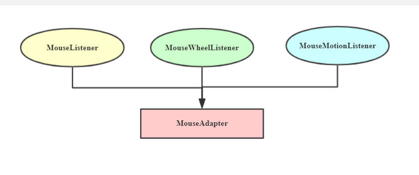
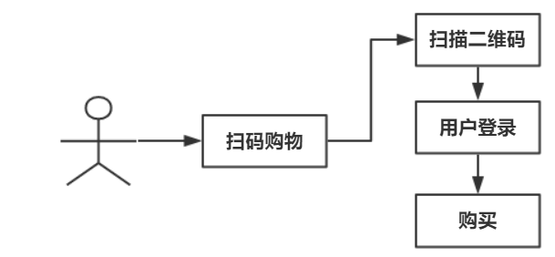
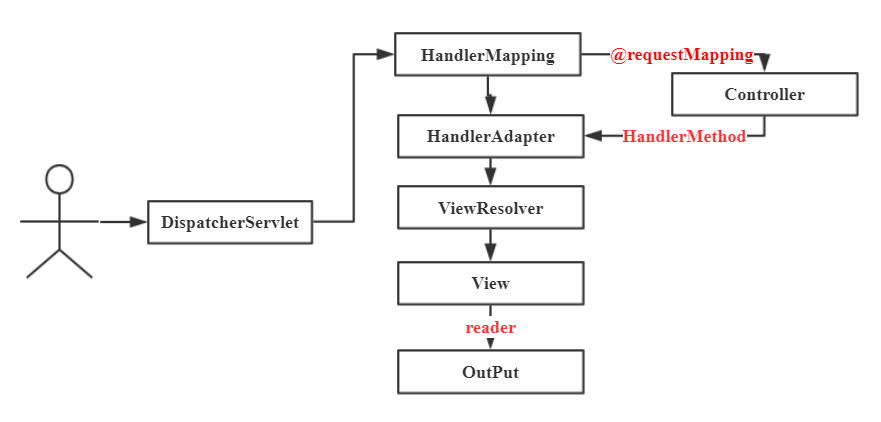
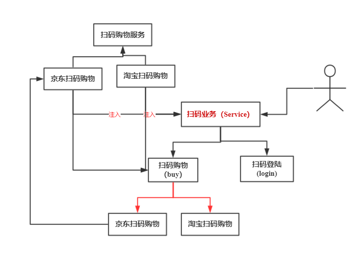

---
tags:
- Spring
- 设计模式
---


#### 议题

- 设计基石
- 结构模式
- 模式差异
- 课堂小结
- 问答互动


### 设计基石

- 封装
  - 对象之间联系
- 继承
  - 对象之间层次
- 多态
  - 对象之间差异


> 对象之间的联系，调用，
>
> 父类，子类，继承
>
> 

## 结构模式

- 代理模式
- 适配器模式
- 装饰器模式
- 享元模式
- 组合模式
- 门面模式
- 桥接模式


### 适配器模式

- 特点：将一个接口转换成为客户端的一个接口
- 关系：适配接口和被适配接口没有层次关系
- 距离：`Java AWT` 、`Java I/O` 、`Spring Web MVC`


​	 `java.awt.event.MouseListener` 是观察者的变种。

​	 `java.awt.event.MouseAdapter` 

```java
public abstract class MouseAdapter implements MouseListener, MouseWheelListener, MouseMotionListener {
```

- 适配器可以有多实现，有滑轮，又有拖放

 

适配器：

字节流转化成为字符流，通过 Adapter 进行转化。

 ```java
public class FileDemo {
    public static void main(String[] args) throws UnsupportedEncodingException, FileNotFoundException {
        // 目前拥有的实例
        InputStream inputStream = new FileInputStream("aaa");
        // 需要的对象
        // InputStream -> Reader
        Reader reader = new InputStreamReader(inputStream, "UTF-8");
        print(reader);
    }

    private static void print(Reader reader){
    }
}
 ```


```java
@RestController
public class OopDesignPatternApplication extends WebMvcConfigurerAdapter {
    @GetMapping("")
    public String hello(){
        return "hello, world";
    }
}
```


### 装饰器模式

- 特点：动态的添加或者覆盖被包装者的接口行为
- 关系：装饰者和被装饰者有层次关系
- 举例： `Spring I/O`  、`Spring Core` 、 `Spring Web MVC` 


 `org.springframework.core.DecoratingClassLoader` 就是继承加上多态。


### 享元模式

- 特点：共享对象状态，减少重复创建
- 关系：享元对象缓存共享实体
- 举例：`Integer 缓存` 、`String intern` 、`Thread Local`


> 这个对象是经常用到的。
>
> Integer
>
> ```java
> public static Integer valueOf(String s, int radix) throws NumberFormatException {
>     return Integer.valueOf(parseInt(s,radix));
> }
> ```
>
> String
>
> ```java
> public native String intern();
> ```


 `ThreadLocal`  *   `ThreadlocalMap` 


享元模式和单例模式有异曲同工模式，

单例：双检查锁。

容器缓存也是，JVM 也是。

主要是 复用


### 组合模式

- 特点：执行组合对象时如同执行其元素对象
- 关系：组合对象和被组合对象是相同类型
- 举例：`EL `、`Spring Cache` 、 `Spring Web MVC` 

> 很重要，

```java
public class CompositeDemo {

    private static interface A{
        void save();
    }

    private static class AImpl implements A{
        @Override
        public void save() {
            System.out.println("save();");
        }
    }

    /**
     * 可实现可不实现
     **/
    private static class CompositeA implements A{
        private Collection<A> list = new ArrayList<>();
        @Override
        public void save() {
            list.forEach(a -> a.save());
        }
    }
}
```


逐一的去处理，迭代的去处理。（**组合模式**）

```java
public Object getValue(ELContext context, Object base, Object property) {
    context.setPropertyResolved(false);
    int sz = this.size;

    for(int i = 0; i < sz; ++i) {
        Object result = this.resolvers[i].getValue(context, base, property);
        if (context.isPropertyResolved()) {
            return result;
        }
    }
    return null;
}
```


 `org.springframework.cache.support.CompositeCacheManager`

代理一般是一对一的关系

缓存，一层一层的缓存，只关心存储这件事情。


##### 组合模式：


##### 代理模式：


#### 一般来说，

发消息，有可能是一对一，有可能是一对多。

`org.springframework.web.servlet.config.annotation.WebMvcConfigurerComposite` 

```java
class WebMvcConfigurerComposite implements WebMvcConfigurer {
    private final List<WebMvcConfigurer> delegates = new ArrayList();
	// ...
}
```


如果是相同类型，我感受不到是组合还是不是组合。


### 门面模式

- 特点：简化接口，聚合子系统实现
- 关系：门面接口和子系统接口自由组合实现
- 举例：Tomcat




> 面向对象接口编程比较琐碎。A、B、C 数据属于相对独立的。

```java
public class FacadeDemo {
    public static void main(String[] args) {

    }
    private static class ServiceA{
        private void save(){
        }
    }
    private static class ServiceB{
        private void save(){
        }
    }

    private static class ServiceFacade{
        private ServiceA serviceA;
        private ServiceB serviceB;
        private void service(){
            serviceA.save();
            serviceB.save();
        }
    }
}
```


## 总计

享元模式一对多，与业务没有太多的关系。

组合模式。多个元素组合执行

门面模式。多个子系统组合执行


接口爆炸，

##### 缺点：

入参会比较复杂，调用链路越长，入参越多，越复杂，用户体验好，但是实现起来不好实现。

```java
public class DispatcherServlet extends FrameworkServlet {
 
    private static final Properties defaultStrategies;
    private boolean detectAllHandlerMappings = true;
    private boolean detectAllHandlerAdapters = true;
    private boolean detectAllHandlerExceptionResolvers = true;
    private boolean detectAllViewResolvers = true;
    private boolean throwExceptionIfNoHandlerFound = false;
    private boolean cleanupAfterInclude = true;
    @Nullable
    private MultipartResolver multipartResolver;
    @Nullable
    private LocaleResolver localeResolver;
    @Nullable
    private ThemeResolver themeResolver;
    @Nullable
    private List<HandlerMapping> handlerMappings;
    @Nullable
    private List<HandlerAdapter> handlerAdapters;
    @Nullable
    private List<HandlerExceptionResolver> handlerExceptionResolvers;
    @Nullable
    private RequestToViewNameTranslator viewNameTranslator;
    @Nullable
    private FlashMapManager flashMapManager;
    @Nullable
    private List<ViewResolver> viewResolvers;
```





`HandlerMapping ` 就是组合模式，


### 桥接模式



 JDBC里边

 **Preparement**

同时注入是策略模式。

```java
public class BirdgeDemo {
    public static void main(String[] args) {
        ScanService scanService = new scanServiceImpl(new ScanbuyService() {
            @Override
            public void buy() {
                System.out.println("JD 扫码购物");
            }
        }, null);

        // scanService.scanBuy() -> scanBuyService.buy();
        // 对于客户端而言，只关注与粗粒度接口，具体执行方法是由运行时初始化而定。
        scanService.scanbuy();


         scanService = new scanServiceImpl(new ScanbuyService() {
            @Override
            public void buy() {
                System.out.println("TaoBao 扫码购物");
            }
        }, null);

    }

    static class scanServiceImpl implements ScanService {
        private ScanbuyService scanbuyService;
        private ScanLoginService scanLoginService;

        scanServiceImpl(ScanbuyService scanbuyService, ScanLoginService scanLoginService) {
            this.scanbuyService = scanbuyService;
            this.scanLoginService = scanLoginService;
        }

        @Override
        public void scanbuy() {
            scanbuyService.buy();
        }

        @Override
        public void scanLogin() {
            scanLoginService.login();
        }
    }

    interface ScanService {
        void scanbuy();

        void scanLogin();
    }

    interface ScanbuyService {
        void buy();
    }

    interface ScanLoginService {
        void login();
    }
}
```


设计模式重要的是思想，

我调用你的时候，我才注入。