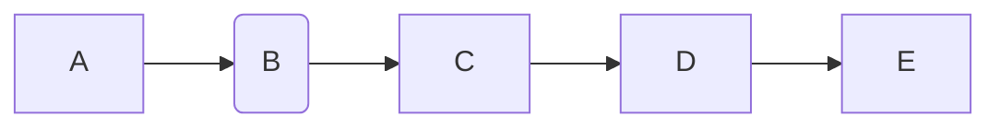

# Reactor Streams 并发编程之 Reactor

### 目标

- 理解 Reactive Streams 编程
- 了解 Reactor 基本使用
- 辅助理解 WebFlux （Spring Framwork 5）

### 议题

- Reactive Streams 规范
- Reactive Streams 框架 - Reactor
- QA

### Reactive Streams 前时代 

- 时代局限性（ Java 9 之前）
  - 阻塞编程
    - 无法并行计算
    - 资源低效使用
  - 异步编程
    - Callback
    - Future

### Reactive Streams 规范 

- Reactive 编程

  ​	一种异步编程的示范，这种示范与数据流式处理以及变化传播相关联，同时也经常被面向对象语言表示，作为一种观察者模式的扩展。

- Reactive Stream 规范（Java 语言）

  ​	 [https](https://github.com/reactive-streams/reactive-streams-jvm)[://](https://github.com/reactive-streams/reactive-streams-jvm)[github.com/reactive-streams/reactive-streams-jvm](https://github.com/reactive-streams/reactive-streams-jvm)    

#### 对比 Iterator 模式

- 数据方向
  - Reactive Streams ：推模式（Push）
  - Iterator ：拉模式（Pull）
- 编程模式
  - Reactive Streams：发布-订阅模式（Publish-Subscriber）
  - Iterator ：命令式编程模式（Imperative）

#### 信号

- onSubscribe()：订阅事件
- onNext()：数据达到事件
- onComplete()：订阅完成事件
- onError()：订阅异常
- request()：请求
- cancel()：取消

### Reactive Streams 框架 - Reactor 

- 核心接口
  - Mono：异步 0-1 元素序列
  - Flux：   异步 0-N 元素系列
- 编程方式
  - 接口编程
  - 函数式编程（Lambda）

- WebFlux
  - Reactor
    - Reactive Streams API

解决 JAVA 9 以前的异步编程

## Reactive 前时代

JAVA 9 之前，阻塞式，

- JAVA 1.4 NIO = Non-Blocking I/O
  - 连接事件
  - 读事件
  - 写事件

> # [Reactor pattern](https://en.wikipedia.org/wiki/Reactor_pattern)
>
> The reactor [design pattern](https://en.wikipedia.org/wiki/Design_pattern_(computer_science)) is an [event handling](https://en.wikipedia.org/wiki/Event_handling) pattern for handling service requests delivered [concurrently](https://en.wikipedia.org/wiki/Concurrency_(computer_science)) to a service handler by one or more inputs. The service handler then [demultiplexes](https://en.wikipedia.org/wiki/Demultiplex)the incoming requests and dispatches them synchronously to the associated request handlers.[[1\]](https://en.wikipedia.org/wiki/Reactor_pattern#cite_note-1) 

主要是多工，

> ### [3.1. Blocking Can Be Wasteful](https://projectreactor.io/docs/core/release/reference/#_blocking_can_be_wasteful)
>
> Modern applications can reach huge numbers of concurrent users, and, even though the capabilities of modern hardware have continued to improve, performance of modern software is still a key concern.
>
> There are broadly two ways one can improve a program’s performance:
>
> 1. **parallelize**: use more threads and more hardware resources.
> 2. **seek more efficiency** in how current resources are used.

阻塞是浪费的。用更多的线程和更多的资源用所谓的并行的方式。

更有效率的去尝试，有更多的资源去读一些东西。

讲的不完全对。

Tomcat、Netty 都是高并发，都是多线程的。

假如说你的 CPU 是 8 核的。

CPU processor  = 8

Tomcat/Netty Thread numbers = 16

- 1 Processor = 2 Threads
- 1 Processor = N Threads  一个处理器，多个线程，轮询执行/时间分片系统

如果你一次处理的时候，不会占用太多的 CPU

所以阻塞式的 I/O 要看情况，

如果是 CPU 密集型， Reactive 都无济于事

1 Thread 把 CPU 占满了，其它线程不得不等待。

> 一个 20G 的文件，给你一个 4G 内存的机器。如何快速的去读？
>
> 很多人说，高并发，开 20 个线程去读。
>
> 4G 内存的，用单线程 for 循环，可能都比它快。

要考虑场景，是 CPU 密集型，还是 I/O 密集型。

文件大的时候，Copy 的时候，是要看情况的。

>### 3.2. Asynchronicity to the Rescue?
>
>- **Callbacks**: Asynchronous methods do not have a return value but take an extra`callback` parameter (a lambda or anonymous class) that gets called when the result is available. A well known example is Swing’s `EventListener` hierarchy.
>- **Futures**: Asynchronous methods return a `Future<T>` **immediately**. The asynchronous process computes a `T` value, but the `Future` object wraps access to it. The value is not immediately available, and the object can be polled until the value is available. For instance, `ExecutorService` running `Callable<T>` tasks use `Future` objects.

`Future` 没有完成的周期回调，

Reactive Streams 规范。

Reactive 是一种观察者模式的扩展

Streams 流式

观察者模式、责任链模式、迭代器模式、发布-订阅模式

