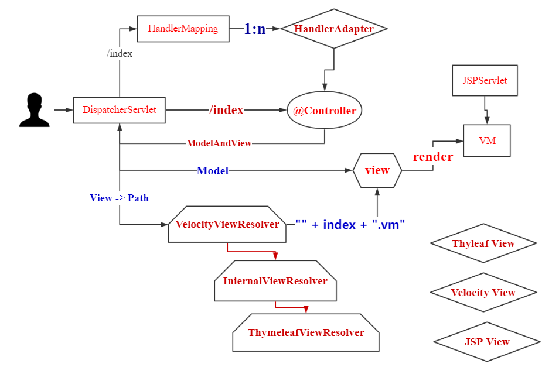
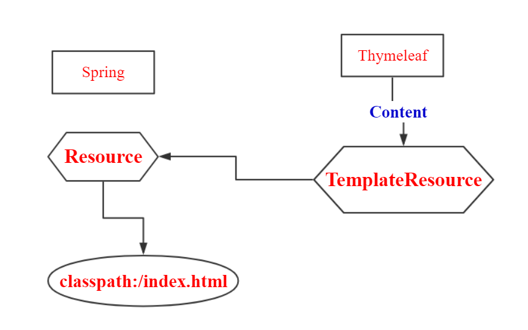

### 本期议题

- 模板引擎核心组件
- Thymeleaf On Spring Web MVC
- Spring Boot 运用 

### 模板引擎核心组件

- 资源管理
- 模板封装
- 模板解析
- 国际化
- 渲染上下文
- 表达式引擎
- 渲染引擎

### Thymeleaf On Spring Web MVC 

- DispatcherServlet

- ThymeleafViewResolver

- SpringTemplateEngine

### Spring Boot 运用 

- 自动装配
  - DispatcherServlet
  - VelocityViewResolver
  - VelocityAutoConfiguration


​	帮助我们去设计一个框架。

​	

​	Spring MVC 、Reactive、Servlet 都可以用 Thymeleaf 。

​	

[Thymeleaf 官网](https://www.thymeleaf.org/) 

Spring Boot 官方推荐 Thymeleaf 

​	当你把一个东西学的很透彻的时候，你可以把一个东西关联起来学习，当你换 framemaker 的时候，自己也可以去整合。

​	见多识广，见得多，优点缺点都知道。


Restful 是 http 协议的一种规范。

- Content-Type: text/html     你需要以这种模式渲染。
- 请求的时候，会发送很多种，我浏览器能够接收很多种类型。




资源管理，

模板的封装的逻辑。


ThymeleafViewResolver

Spring 做了很多抽象。

`Thymeleaf` 就很慢


- 性能
  - JSP > velocity > Thymeleaf 


Spring Cloud 会越来越成熟。

Spring Boot 不具备分布式

​	Eureka 支撑不起来 `5w-10w` 台机器。内存型的注册中心，都会有问题。重启很麻烦。越搞越复杂。同步越来愈慢，负载均衡！！！

微服务，依赖管理也很重要。

- web mvc
- reactive web

都可以。


JSP = Servlet 必须要有 servlet ，性能上肯定是最好的。JAVAServer Page


> ## 1.2 What kind of templates can Thymeleaf process?
>
> Out-of-the-box, Thymeleaf allows you to process six kinds of templates, each of which is called a **Template Mode**:
>
> - HTML
> - XML
> - TEXT
> - JAVASCRIPT
> - CSS
> - RAW

 	 Thymeleaf 和 HTML 是紧耦合的。 `模板引擎` 和 `页面渲染` 其实不是等价的。模板引擎可以用到很多特色方面。模板引擎主要是，我有一个模式，有一个模板，把中间的占位符进行替换，这就叫 `模板引擎` ，至于它是不是 HTML、XML 都是无所谓的。因为它最后输出 String。


> ## 1.3 Dialects: The Standard Dialect
>
> ```
> The official thymeleaf-spring3 and thymeleaf-spring4 integration packages both define a dialect called the “SpringStandard Dialect”, which is mostly the same as the Standard Dialect, but with small adaptations to make better use of some features in the Spring Framework (for example, by using Spring Expression Language or SpringEL instead of OGNL). So if you are a Spring MVC user you are not wasting your time, as almost everything you learn here will be of use in your Spring applications.
> ```
>
> 


Dialect Mybatis

Spring EL 


JSTL 有操作，EL 主要是语言   


html 、http、xml 都很重要。


#### Spring Thymeleaf

路径表达有很多种方式，

Thymeleaf

- `ResourceLoader` 
  - `DefaultResourceLoader`    -    `ProtocolResolver` 

一种是通过 JDK 去做。

第二种是 `ProtocalResolver` 但是版本必须 `4.3` 以上才能做这个事情。


`since 4.3` 

##### `org.springframework.core.io.DefaultResourceLoader` 

```java
public Resource getResource(String location) {
    Assert.notNull(location, "Location must not be null");
    Iterator var2 = this.protocolResolvers.iterator();

    Resource resource;
    do {
        if (!var2.hasNext()) {
            if (location.startsWith("/")) {
                return this.getResourceByPath(location);
            }

            if (location.startsWith("classpath:")) {
                return new ClassPathResource(location.substring("classpath:".length()), this.getClassLoader());
            }

            try {
                URL url = new URL(location);
                return (Resource)(ResourceUtils.isFileURL(url) ? new FileUrlResource(url) : new UrlResource(url));
            } catch (MalformedURLException var5) {
                return this.getResourceByPath(location);
            }
        }

        ProtocolResolver protocolResolver = (ProtocolResolver)var2.next();
        resource = protocolResolver.resolve(location, this);
    } while(resource == null);

    return resource;
}
```


#### 版本的意识

一将无能累死千军。然后走  `new URL()` 


##### 模板封装。

`spring-boot-velocity` 


​	前后端分离，

​	模板引擎，并不是仅仅支持 HTML 这一种文件类型，要深刻的理解，也可输出成 javascript 等。

​	前端用 VUE 或者 reatcor  以后，thymeleaf  就没有太大用处了。


Template


##### 模板解析 resolver 


ITemplateResolver （接口开源都用 I 开头）

ServertContextViewResolver


```java
public enum TemplateMode {
    HTML(true, false, false),
    XML(false, true, false),
    TEXT(false, false, true),
    JAVASCRIPT(false, false, true),
    CSS(false, false, true),
    RAW(false, false, false),
    /** @deprecated */
    @Deprecated
    HTML5(true, false, false),
    /** @deprecated */
    @Deprecated
    LEGACYHTML5(true, false, false),
    /** @deprecated */
    @Deprecated
    XHTML(true, false, false),
    /** @deprecated */
    @Deprecated
    VALIDXHTML(true, false, false),
    /** @deprecated */
    @Deprecated
    VALIDXML(false, true, false);
}
```


​	Spring 是一个好的设计，它深入到每一行代码中，思考如何让你的代码简单好用。

​	

##### 国际化

`java.util.ResourceBundle`   java 的国际化。

ResourceBundle 是 `文件` 里边的或者 `jar` 包里边的。

JAVA 8 可以脱离这个东西的。


since 1.8 

`java.util.spi.ResourceBundleControlProvider`  

实现一套覆盖掉与有的 `文件系统` ，也可以走分布式，配置中心，或者数据库都可以。


`java.util.Locale`  语言。

country

languary


浏览器里边有默认语言 英语。

acepty language

`javax.servlet.ServletRequest#getLocale`  

当你请求发送过来的时候，会得到。

技术就是闭环，没有独立的技术。


架构师思考问题要深入一点。


Spring 

`org.springframework.context.MessageSource#getMessage(java.lang.String, java.lang.Object[], java.util.Locale)`   

要传一个 语言，语种，进来，返回来相应的东西。

>What we can see here are in fact two different features of the Thymeleaf Standard Dialect:
>
>- The `th:text` attribute, which evaluates its value expression and sets the result as the body of the host tag, effectively replacing the “Welcome to our grocery store!” text we see in the code.
>- The `#{home.welcome}` expression, specified in the *Standard Expression Syntax*, instructing that the text to be used by the `th:text` attribute should be the message with the `home.welcome` key corresponding to whichever locale we are processing the template with.
>
>Now, where is this externalized text?
>
>The location of externalized text in Thymeleaf is fully configurable, and it will depend on the specific `org.thymeleaf.messageresolver.IMessageResolver` implementation being used. Normally, an implementation based on `.properties` files will be used, but we could create our own implementations if we wanted, for example, to obtain messages from a database.
>
>However, we have not specified a message resolver for our template engine during initialization, and that means that our application is using the *Standard Message Resolver*, implemented by `org.thymeleaf.messageresolver.StandardMessageResolver`.
>
>The standard message resolver expects to find messages for `/WEB-INF/templates/home.html` in properties files in the same folder and with the same name as the template, like:
>
>- `/WEB-INF/templates/home_en.properties` for English texts.
>- `/WEB-INF/templates/home_es.properties` for Spanish language texts.
>- `/WEB-INF/templates/home_pt_BR.properties` for Portuguese (Brazil) language texts.
>- `/WEB-INF/templates/home.properties` for default texts (if the locale is not matched).


也可以放到数据库中，


##### 渲染上下文


##### 表达式引擎


##### 渲染引擎


`org.thymeleaf.ITemplateEngine` 

```java
/* 
 * 为什么框架喜欢把模板引擎进行封装，因为 String 不好表达语义。
 * 究竟是模板的名称还是模板的内容呢?
 */
public String process(final String template, final IContext context);
```

用 String 非常的有歧义。

`evaluate` 评估就是翻译的意思。


#### 渲染引擎

```java
public class ThymeleafEngineDemo {
    public static void main(String[] args) {
        // 构建引擎
        TemplateEngine templateEngine = new SpringTemplateEngine();

        // 创建渲染上下文
        Context context = new Context();
        context.setVariable("message", "Hello, World");
        // 模板内容
        String content = "<p th:text=\"${message}\">!!!</p>";
        // 渲染（处理）结果
        String result = templateEngine.process(content, context);

        System.out.println(result);
    }
}
```

还可以设置模板类型。

他并不依赖 Spring Spring Boot 

这就是 模板引擎的 强大之处。这是一个文本协议，


`SpringResouceTemplateResolver` 





