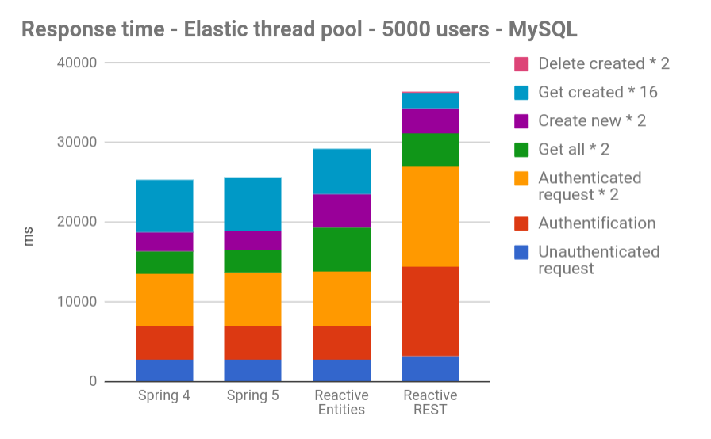
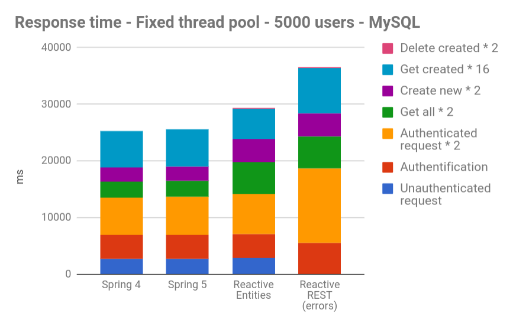
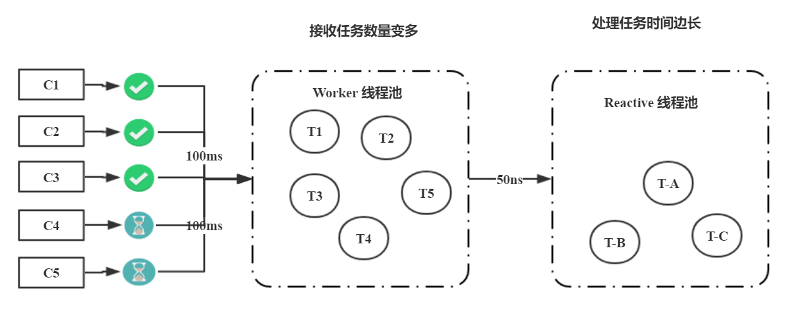

# Spring Boot 2.0 新特性和我们有关系吗？

> 社会有一股浮夸风，不知道的乱讲，知道的也乱讲
>
> Spring Boot 2.x 和 Eureka 的停更没有一点关系。
>
> Eureka 1.x 没有停更， Spring 2.x 用的是 eureka 1.x，Eureka 2.x 从来没有开源过。
>
> - 三四万的实例数，eureka 确实是不行。


#### Spring Boot 2.0 官方图：

 


##### 依赖 

- Spring Framework 5
  - Kotlin
- Java 8
- Reactor（可选的依赖 `OPTIONAL DEPENDENCY`）
  - 底层依赖 Netty ( NIO ) `? 是不是真的好呢？`
  - Reactive Streams JVM 规范的实现 
  - Spring WebFlux
    - Functional Endpoints
      - 抄袭 Vert.x （偷师）
  - Spring Cloud Getway
    - Spring Cloud 1.x zuul  ( 性能比 Getway 好一点 )
    - Netflix Zuul2  ( 基于 Netty )


- Spring Boot 1.x

  - | ~~tomcat 5.5~~ | ~~servlet 2.4~~      |
    | -------------- | -------------------- |
    | ~~tomcat 6.0~~ | ~~servlet 2.5~~      |
    | ~~Tomcat 7.0~~ | ~~servlet 3.0~~      |
    | **Tomcat 8.0** | **servlet 3.1**      |
    | **Tomcat 8.5** | **servlet 4.x prev** |

  - Tomcat 8.0

    - servlet 3.1
    - webSocket

  - tomcat 8.5

    - servlet 4.0 prev
    - websocket


### Reactive 相关

> Spring MVC 构建在 servlet 用同步阻塞的 IO 实现一问一答的。
>
> WebServlet 是支持 **`异步`** 的。 
>
> Spring MVC 也是支持异步的 `DeferredResult` ，也是异步 IO
>
> Servlet 3.1 之后，也支持了 `非阻塞` ，`WriteListener` 接受一个写的事件通知。非阻塞必须基于异步。就是异步非阻塞必须同时来用。
>
> Reactive Stack 
>
> 是一个非阻塞的，利用多核（现在电脑都是多核啊），突破硬件只能从 JVM 层面突破。NIO 等都是 JVM 去支持的。Netty 只是基于它做了一些封装。成为了高性能的框架。
>
> Servlet 3.1 就是 NIO 的。
>
> reactive 是非阻塞的，可以是同步，也可以异步


WebFlux 并不是想要替换 WebMVC

> #### [1.1.4. Applicability](https://docs.spring.io/spring/docs/5.1.3.RELEASE/spring-framework-reference/web-reactive.html#webflux-framework-choice)
>
> Spring MVC or WebFlux?
>
> A natural question to ask but one that sets up an unsound dichotomy. Actually, both work together to expand the range of available options. The two are designed for continuity and consistency with each other, they are available side by side, and feedback from each side benefits both sides. The following diagram shows how the two relate, what they have in common, and what each supports uniquely:
>
> 
>
> We suggest that you consider the following specific points:
>
> - If you have a Spring MVC application that works fine, there is no need to change. Imperative programming is the easiest way to write, understand, and debug code. You have maximum choice of libraries, since, historically, most are blocking.
> - If you are already shopping for a non-blocking web stack, Spring WebFlux offers the same execution model benefits as others in this space and also provides a choice of servers (Netty, Tomcat, Jetty, Undertow, and Servlet 3.1+ containers), a choice of programming models (annotated controllers and functional web endpoints), and a choice of reactive libraries (Reactor, RxJava, or other).
> - If you are interested in a lightweight, functional web framework for use with Java 8 lambdas or Kotlin, you can use the Spring WebFlux functional web endpoints. That can also be a good choice for smaller applications or microservices with less complex requirements that can benefit from greater transparency and control.
> - In a microservice architecture, you can have a mix of applications with either Spring MVC or Spring WebFlux controllers or with Spring WebFlux functional endpoints. Having support for the same annotation-based programming model in both frameworks makes it easier to re-use knowledge while also selecting the right tool for the right job.
> - A simple way to evaluate an application is to check its dependencies. If you have blocking persistence APIs (JPA, JDBC) or networking APIs to use, Spring MVC is the best choice for common architectures at least. It is technically feasible with both Reactor and RxJava to perform blocking calls on a separate thread but you would not be making the most of a non-blocking web stack.
> - If you have a Spring MVC application with calls to remote services, try the reactive `WebClient`. You can return reactive types (Reactor, RxJava, [or other](https://docs.spring.io/spring/docs/5.1.3.RELEASE/spring-framework-reference/web-reactive.html#webflux-reactive-libraries)) directly from Spring MVC controller methods. The greater the latency per call or the interdependency among calls, the more dramatic the benefits. Spring MVC controllers can call other reactive components too.
> - If you have a large team, keep in mind the steep learning curve in the shift to non-blocking, functional, and declarative programming. A practical way to start without a full switch is to use the reactive `WebClient`. Beyond that, start small and measure the benefits. We expect that, for a wide range of applications, the shift is unnecessary. If you are unsure what benefits to look for, start by learning about how non-blocking I/O works (for example, concurrency on single-threaded Node.js) and its effects.
>
> #### [1.1.6. Performance](https://docs.spring.io/spring/docs/5.1.3.RELEASE/spring-framework-reference/web-reactive.html#webflux-performance)
>
> Performance has many characteristics and meanings. Reactive and non-blocking generally do not make applications run faster. They can, in some cases, (for example, if using the `WebClient` to execute remote calls in parallel). On the whole, it requires more work to do things the non-blocking way and that can increase slightly the required processing time.
>
> The key expected benefit of reactive and non-blocking is the ability to scale with a small, fixed number of threads and less memory. That makes applications more resilient under load, because they scale in a more predictable way. In order to observe those benefits, however, you need to have some latency (including a mix of slow and unpredictable network I/O). That is where the reactive stack begins to show its strengths, and the differences can be dramatic.
>
> ```
> 性能有很多指标，reactive 不是让应用程序更快，而是让应用在更小的资源去提高伸缩性。
> 他需要更多的工作去非阻塞的方式，
> 单向请求 NIO 和 BIO 更慢，NIO 需要一个状态的流转。 Netty 中 EventLoop， 切换状态
> 
> ```
>
> #### WebFlux 和 Web MVC 并没有太多性能上的提升，不能用于系统的性能的提升。
>
> 


什么叫 `额外的操作` ？

```java
public class FluxDemo {
    public static void main(String[] args) {
        reactor();
        forEach();
    }

    public static void reactor() {
        long start = System.currentTimeMillis();
        Flux.just(1, 2, 3).subscribe(System.out::println);
        System.out.println("reactor 耗时：" + (System.currentTimeMillis() - start));
    }

    public static void forEach() {
        long start = System.currentTimeMillis();
        Stream.of(1, 2, 3).forEach(System.out::println);
        System.out.println("forEach 耗时：" + (System.currentTimeMillis() - start));
    }
}
```

```verilog
reactor 耗时：163
forEach 耗时：0
```

reacive 在构建的时候都会产生数据。

它的数据结构比较复杂，所以创建起来比较麻烦

> ```java
> class ExampleHandler implements WebSocketHandler {
> 
>     @Override
>     public Mono<Void> handle(WebSocketSession session) {
>         return session.receive()            
>                 .doOnNext(message -> {
>                     // ...                  
>                 })
>                 .concatMap(message -> {
>                     // ...                  
>                 })
>                 .then();                    
>     }
> }
> ```

你每次创建，和消费的时候，都要创建这个一个东西，什么是非阻塞，就是当前我不去阻塞它，我后续.......

性能就差距在这个地方。


> https://blog.ippon.tech/spring-5-webflux-performance-tests/
>
>  
>
>  
>
>  
>
> # Conclusion
>
> - *No improvement in speed was observed with our reactive apps (the Gatling results are even slightly worse).*
> - *Concerning user-friendliness, reactive programming does not add a lot of new code, but it certainly is a more complex way of coding (and debugging…). A quick Java 8 refresher might be required.*
> - *The main problem right now is the lack of documentation. It has been our greatest obstacle in generating test apps, and we may have missed a crucial point because of that.We therefore advise not to jump too quickly on reactive programming and wait for more feedback. Spring WebFlux has not yet proved its superiority over Spring MVC.*
>
> ```
> WebFlux 并没有性能上的提升，可能更糟糕。
> ```


#### Reacive 动机

> ### [1.1. Overview](https://docs.spring.io/spring/docs/5.1.3.RELEASE/spring-framework-reference/web-reactive.html#webflux-new-framework)
>
> Why was Spring WebFlux created?
>
> Part of the answer is the need for a non-blocking web stack to handle concurrency with a small number of threads and scale with fewer hardware resources. Servlet 3.1 did provide an API for non-blocking I/O. However, using it leads away from the rest of the Servlet API, where contracts are synchronous (`Filter`, `Servlet`) or blocking (`getParameter`, `getPart`). This was the motivation for a new common API to serve as a foundation across any non-blocking runtime. That is important because of servers (such as Netty) that are well-established in the async, non-blocking space.
>
> The other part of the answer is functional programming. Much as the addition of annotations in Java 5 created opportunities (such as annotated REST controllers or unit tests), the addition of lambda expressions in Java 8 created opportunities for functional APIs in Java. This is a boon for non-blocking applications and continuation-style APIs (as popularized by `CompletableFuture` and [ReactiveX](http://reactivex.io/)) that allow declarative composition of asynchronous logic. At the programming-model level, Java 8 enabled Spring WebFlux to offer functional web endpoints alongside annotated controllers.
>
> ```
> 非阻塞 web 技术栈，去处理并发的请求，在更少的线程，用少量的资源去提升应用的伸缩性。
> ```


ms 10^-3^

ns 10^-9^

#### 图解 Reactive:




将近 2千万或者 2 亿次 的计算。

他少了一个点：

那么后边的人怎么办？


`java.util.concurrent.ThreadPoolExecutor` 

```java
public ThreadPoolExecutor(int corePoolSize,
                          int maximumPoolSize,
                          long keepAliveTime,
                          TimeUnit unit,
                          BlockingQueue<Runnable> workQueue) {
    this(corePoolSize, maximumPoolSize, keepAliveTime, unit, workQueue,
         Executors.defaultThreadFactory(), defaultHandler);
}
```

`BlockingQueue` 阻塞队列。

会造成后边相当多的阻塞。

###### 是不是适合 RPC ，web 请求，有待商榷？

成千上万请求过来了，怎么办

HTTPclient 发送一个请求过去，可能 2，3 秒都没有回来， 半天没有响应，有没有 `超时` 。


##### 什么是函数式编程？


> 
>
> ```java
> import static org.springframework.http.MediaType.APPLICATION_JSON;
> import static org.springframework.web.reactive.function.server.RequestPredicates.*;
> import static org.springframework.web.reactive.function.server.RouterFunctions.route;
> 
> PersonRepository repository = ...
> PersonHandler handler = new PersonHandler(repository);
> 
> RouterFunction<ServerResponse> route = route()
>     .GET("/person/{id}", accept(APPLICATION_JSON), handler::getPerson)
>     .GET("/person", accept(APPLICATION_JSON), handler::listPeople)
>     .POST("/person", handler::createPerson)
>     .build();
> 
> public class PersonHandler {
>     // ...
>     public Mono<ServerResponse> listPeople(ServerRequest request) {
>         // ...
>     }
>     public Mono<ServerResponse> createPerson(ServerRequest request) {
>         // ...
>     }
>     public Mono<ServerResponse> getPerson(ServerRequest request) {
>         // ...
>     }
> }
> ```
>
> 
>
> https://vertx.io/docs/vertx-web/java/
>
> java 和 Javascript 是慢慢的比较像。
>
> #### Reactive 主要强调吞吐量要上去，但是你要思考你到底要不要吞吐量这个东西。


## Spring application


Spring Boot 事件 / Spring 事件

Spring `org.springframework.context.ConfigurableApplicationContext` 

##### Spring 上下文层次性

`org.springframework.boot.SpringApplicationRunListener` 

- `org.springframework.boot.context.event.EventPublishingRunListener` (控制这个类) 

  - Spring Boot 事件 （控制）

    - 外部化配置的加载（ application.properties / application.yaml ）

    - 日志加载（ Logging System : logback、Log4j2、Java Logging ）

      > 它可以重复加载有点坑，


##### `org.springframework.boot.logging.logback.LogbackLoggingSystem` 

```java
public class LogbackLoggingSystem extends Slf4JLoggingSystem {
    // 在这里把日志的层次传递进来，日志的级别是统一的。
    static {
        LEVELS.map(LogLevel.TRACE, Level.TRACE);
        LEVELS.map(LogLevel.TRACE, Level.ALL);
        LEVELS.map(LogLevel.DEBUG, Level.DEBUG);
        LEVELS.map(LogLevel.INFO, Level.INFO);
        LEVELS.map(LogLevel.WARN, Level.WARN);
        LEVELS.map(LogLevel.ERROR, Level.ERROR);
        LEVELS.map(LogLevel.FATAL, Level.ERROR);
        LEVELS.map(LogLevel.OFF, Level.OFF);
        FILTER = new TurboFilter() {
            public FilterReply decide(Marker marker, ch.qos.logback.classic.Logger logger, Level level, String format, Object[] params, Throwable t) {
                return FilterReply.DENY;
            }
        };
    }
}
```


## 外部化配置（Externalized Configuration）

- Spring Framework
  - `org.springframework.validation.DataBinder` 
  - PropertySource
  - Spring 1.x `RelaxedDataBinder`   ( 2.x remove )
- Spring Boot 2.x
  - `org.springframework.boot.context.properties.bind.Binder`  ( 函数式 )
  - ConfigurationPropertySource


> 以前都是一个 String ，在变成了 类了，
>
> 过滤，都是 filter  都是  函数式，会让你看起来比较难看懂。

###### Demo

```java
@ConfigurationProperties("user")
public static class User{
    private List<String> addresses;
}
// user.addresses[0]=A
// user.addresses[1]=B
```

##### 成千上万的应用如何管理？


> 学习很难，要坚持！！！
>
> 21 年都不一定能精通  **JAVAEE** 


## Spring WebFlux


> WebFlux 和 Spring Web MVC 设计上 `如出一辙` 


## 嵌入式容器


Spring Boot 2.x

- Servlet 3.1 +
  - 支持 WebFlux ( Reactor -> Servlet 3.1 + 适配 )
  - 需要一些额外工作 Servlet 4.0 HTTP/2
- Netty Web Server
  - Netty Reactor
    - WebFlux


> 面试题害了很多人，都是十几年前的题目。
>
> 反思一下自己的创新，是不是真的更新。大家思考模式变了，大家都会提升。
>
> 如何判定一个对象是不是相等，来写段代码出来。
>
> 逻辑等和物理等。怎么搞？
>
> 软引用，弱引用，用在什么地方。
>
> ReferenceQueue 是 JVM 来操作1的。`Treated specially by GC` ，很多东西从代码里边去找，代码里边没有，去  **JVM** 中去找。先看一些入门的东西，产生一些概念，然后有一套标准的作业流程。有一个标准的思路。不因面试的题目而变化自己的思考方式。
>
> - 高并发题目，写一个生产者，消费者。
>   - `synchronized` 
>     - `#notify`
>   - `lock` 
>     - `#newCondition`   
>       - `Condition#await`
>
> 很多代码都要用在代码里边的。要有思路。Talking is cheap, show me your code .


##### Spring Boot 1.0 ~ 2.0 自定义容器的 API 编程不兼容。

- 协程的问题。协程有上下文。
- 协程基于 `ThreadLocal` 的话，不同的 协程，会利用同一个线程，线程数据会有耦合，先要理解 JVM 能够提供什么东西给你，你在能去做好一些事情。协程（比线程更小的单位。）


- Blocking
  - Lock
  - Lock-free CAS

都会有锁，阻塞你的读之类的。

> 了解根本的东西，不要被人骗了。


## Spring Boot Actuator

##### Spring Boot 1.0 ~ 2.0  API 编程不兼容。

healthcheck


JMX 默认支持

Web 开发支持


- spring boot 2.x

  ```properties
  management.endpoints.web.exposure.include=*
  ```

  http://localhost:8080/actuator

  http://localhost:8080/actuator/health


2.x 会有一个 `org.springframework.boot.actuate.endpoint.annotation.Endpoint` 


API 之前是 Endpiont -> AbstractEndpoint -> 


1.3 1.4 变化 

1.5 安全有点提升。

- spring Boot 1.x

  HeanlthMvcEndpoint  拼出来的。


