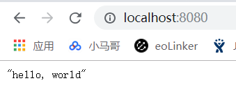
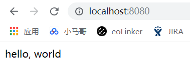
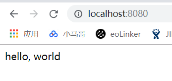

### 议题：

- 为什么要使用 Web Flux
- 从 Web MVC 过度到 Web Flux
- 函数式 Endpoint

#### 为什么要使用 Web Flux 

- 非阻塞编程
  - NIO
  - Reactive 
- 函数式编程
  - Lambda
  - Kotlin

#### 从 Web MVC 过度到 Web Flux 

- Annotation Controller
- WebFlux 配置
- Reactor 框架

#### 函数式 Endpoint 

- HandlerFunction

- RouterFunction


​	Spring MVC 可以直接迁移到 Spring WebFlux 。

​	现在很多人都在用 Web MVC ，很少用 WebFlux，函数式 Endpoint。

​	编程模型没有很多的更新。NIO 是 非阻塞式 I/O ，在 JAVA 7 里边，增加了一个 AIO 的概念，增加了一个并行，增加了异步的方式，

​	 https://github.com/reactive-streams/reactive-streams-jvm

​	 [Reactive-Stream](https://github.com/reactive-streams/reactive-streams-jvm) 是一种编程模型，编程规范，Spring Cloud 里边 `hystrix` 就是基于 RxJava 的，RxJava 就是 Reactive 的拓展，现在用的不是特别多，在安卓用的比较多。

# [Web on Reactive Stack](https://docs.spring.io/spring/docs/5.1.3.RELEASE/spring-framework-reference/web-reactive.html#spring-webflux)

> Why was Spring WebFlux created?
>
> Part of the answer is the need for a non-blocking web stack to handle concurrency with a small number of threads and scale with fewer hardware resources. Servlet 3.1 did provide an API for non-blocking I/O. However, using it leads away from the rest of the Servlet API, where contracts are synchronous (`Filter`, `Servlet`) or blocking (`getParameter`, `getPart`). This was the motivation for a new common API to serve as a foundation across any non-blocking runtime. That is important because of servers (such as Netty) that are well-established in the async, non-blocking space.

Part of the answer is the need for a non-blocking web stack to handle concurrency with a small number of threads and scale with fewer hardware resources.

非阻塞的 web 的技术栈，同时来处理并行的一些东西，不是理由的理由，把大多数开发人员当成 250 在耍，Tomcat 8 以后，一种是 BIO，一种是 NIO， `-8080BIO` 中缀，就是 Tomcat 6 或者 Tomcat 7 的版本，就是 Tomcat 8 中就有了非阻塞式的编程了，问题的关键在于什么地方是阻塞，什么地方是应该所谓的并发去处理，在 Servlet 3.1 中已经给一种异步的编程方式。


##### 示例：

```java

```

request 先发起来的一种 `AsyncContext` 异步的上下文，相应的处理的方式，它是有一种监听器，

`#onComplete()`、`#onTimeout()`、`#onError()`、`#onStartAsync()`   四种状态和 Reactive 有一些类似


```java
public interface Subscriber<T> {
    public void onSubscribe(Subscription s);
    public void onNext(T t);
    public void onError(Throwable t);
    public void onComplete();
}
```

​	订阅者，这是一个订阅者， Sevlet 3.0 就开始了异步了。很多技术都有一种哲学上的东西。

​	异步的时候，就是开启一个线程池，Servlet 3.0 里边异步的方式用的非常少，大多数的时候，都用的是自己写个线程池，或者用 Spring MVC 写一个线程池，

​	就是 NIO，

`Async-web` 项目： 

```html
http-nio-8080-exec-1 开始执行！ http-nio-8080-exec-2 执行中！ http-nio-8080-exec-3 执行完成
```

​	


它是不是阻塞和非阻塞，是你自己去权衡的，阻塞，非阻塞都是同步的，如果不是同步的话，就会遇到线程安全的问题，我们以前遇到的 ThreadLocal ，spring MVC 用到了很多 ThreadLocal

##### `org.springframework.web.context.request.RequestContextHolder`  

```java
public static void setRequestAttributes(@Nullable RequestAttributes attributes, boolean inheritable) {
   if (attributes == null) {
      resetRequestAttributes();
   }
   else {
      if (inheritable) {
         inheritableRequestAttributesHolder.set(attributes);
         requestAttributesHolder.remove();
      }
      else {
         requestAttributesHolder.set(attributes);
         inheritableRequestAttributesHolder.remove();
      }
   }
}
```

##### `org.springframework.web.context.request.ServletRequestAttributes` 

```java
private static final boolean jsfPresent =
      ClassUtils.isPresent("javax.faces.context.FacesContext", RequestContextHolder.class.getClassLoader());

private static final ThreadLocal<RequestAttributes> requestAttributesHolder =
      new NamedThreadLocal<>("Request attributes");

private static final ThreadLocal<RequestAttributes> inheritableRequestAttributesHolder =
      new NamedInheritableThreadLocal<>("Request context");
```

​	把你的请求放到这里来了，他使用的 `ThreadLocal` ，`ThreadLocal` 你是同一个线程的时候使用，如果不是同一个线程使用的话，就会出现相应的问题。

​	我们的 开始，结束，超时，错误，事件回调的时候，会把我们每个操作的线程名称打印出来，意味着，当每个方法被回调的时候，它会他的请求打印出来，线程池里边的序号不是一一对应的。它执行中的时候呢，有一个异步的过程，那么这是它一个异步的特点，但是这个异步的特点并不能说明它是一个非阻塞的异步。只能说明它是一个异步。这是 `Sevlet 3.0` 的一个规范，


Spring 官网：

Servlet 3.1 提供了一种 Non-blocking I/O，


​	软件架构怎么怎么搞，**Dubbo** ? **Zookeeper** ?  **Framework** ? 不能只了解源码，需要了解源码的背后它很多很多的哲学上的东西，Tomcat 8 的里边已经是 `非阻塞式IO` 了，基于事件的，`非阻塞` 不代表它不阻塞，这是 `多工` 的意思 ，严格意义上阻塞是同步的意思。一个 CPU 执行一条命令的时候，它是一个一个执行的，那么非阻塞的时候呢，无非是我一个 `CPU` 在轮询的时候，同一个CPU 可以执行多个指令，并不能代表它是异步的，

​	 **`并行`** 和 **`并发`** 到底什么区别？并行是 `同时` 干 若干个事情，并发，是 `一起` 干很多事情。一起干，不代表同时干，可能是 你干一个，他干一个，我们经常在操作系统原理里边讲到， `并行` 它是什么东西呢？感觉上大家在一起做，只是一种 `感觉` 。在面试的时候，很多时候是考验你对一些概念上的东西是不是有一个深刻上的理解。当你有一个深刻理解的时候，你做的东西才不会那么走样，否则的话，你只是记一个东西，很多时候，大家在面试的时候，都是在被那个 `答案` 。

​	 `WebFlux` 非常简单，没有以前那么复杂，从 `Spring MVC` 到 `Spring WebFlux` 是没有难度的。


​	 `ServletInpuStream.setReadListener` or `servletOutputStream.setWriterListener` 当我们很了解，Spring MVC 的时候，不会很去了解 **Servlet** 的 API ，

`javax.servlet.http.HttpServletRequest` 

- `javax.servlet.ServletRequest#getInputStream` 

在 3.1 的时候， **Spring Boot** 本身就是 **Servlet 3.1** 的支持，

系统要求： [Servlet Containers](https://docs.spring.io/spring-boot/docs/2.1.1.RELEASE/reference/htmlsingle/#getting-started-system-requirements-servlet-containers) 

> ## 9.1 Servlet Containers
>
> Spring Boot supports the following embedded servlet containers:
>
> | Name         | Servlet Version |
> | ------------ | --------------- |
> | Tomcat 9.0   | 4.0             |
> | Jetty 9.4    | 3.1             |
> | Undertow 2.0 | 4.0             |

一个是 `Read` 一个是 `Writer` ，里边有一个 事件监听 `Listener` ，

`javax.servlet.ServletInputStream#setReadListener` 

##### `javax.servlet.ReadListener`

```java
public interface ReadListener extends EventListener {
    // 告诉你数据已经准备好了，可以连接了
    void onDataAvailable() throws IOException;
	// 所有的数据，我已经读完了
    void onAllDataRead() throws IOException;

    void onError(Throwable var1);
}
```

`Readlistener` 其实也是一个 `事件回调` 

 所有的 NIO ，非阻塞，就是把一件事情分成了多件事情来做，比如说，NIO 会告诉你，InputStream 、 OutpusStream 有一个相应的事件 `java.nio.file.WatchEvent.Kind` 它是一个

```java
/**
 * An event kind, for the purposes of identification.
 * 文本观测的事件
 * @since 1.7
 * @see StandardWatchEventKinds
 */
public static interface Kind<T> {
```

NIO 里边有，所谓的 连接事件、写事件、读事件，然后， 


​	NIO 是一部分一部分的数据把它传递过来，NIO 在数据量小的时候，或者说数据量不频繁的时候，是没有什么优势的。他对持续的链接，在 `大并发` 的情况下，它才会有一定的价值，很大程度上面，像 **Netty**  它就有很多的事件回调，无论它异步还是同步，它是 **NIO** 的。

​	他和 很多时候都很像， **Netty** 做的比较好，是因为它屏蔽了一些细节，通过回调接口的方式让你来进行相应的操作，然后你就会对它的操作变得简单一点。Servlet 3.0 提供了异步，Servlet 3.1 提供了 NIO ，Servlet 3.1 提供了一种新型的方式叫做 `WebSocket` 的方式，

> #### Upgrade Processing 
>
> （Servlet 3.1 规范里边的）

​	所谓的协议的升级，就是 WebSocket 第一次请求的时候是一个普通的 HTTP 请求，这时候，服务端或告诉它，我要把你相应的 TCP 的协议进行一个升级，进行一个转换一下，这是一个机制，在 **Servlet 3.1** 里边其实也是有的。

​	在我们的 Tomcat 里边是一种方式实现两种方法，通过一种方式，可以实现 webSocket ，也可以实现 普通的一种实现，

​	 `javax.servlet.http.HttpUpgradeHandler` 

```java
public interface HttpUpgradeHandler {
    void init(WebConnection var1);

    void destroy();
}
```

​	在 Tomcat 8 里边有一个 HTTP/2 的一个处理的方式，HTTP/2 完完全全就变成长连接，WebSocket 是一个版长连接，第一步不是长链接，第二步才是长连接，WebConnection 是一种，

​	WebSocket 并不是一个浏览器的技术，比方说，你手机的客户端也可能支持这个技术，这是 Http 和 webSocket 的一个变种吧，浏览器是我们 Web 客户端的一种实现，但是并不是所得的实现，你如果用 **Postman** 来做这个操作，也是可以的。


Servlet 3.1 不用 Servlet 3.1 是不是就不可以用 WebFlux 了呢？

WebFlux 默认的是用 Netty 来实现它的 WebServer。那就是利用一些 **Netty** 的一些 API 来做它的操作，我们传统的 MVC 用的是一些 Servlet 的 API ，请求和相应，我们，


其实 WebFlux 默认的情况下并不是 **异步** 的。

> ​	The other part of the answer is functional programming. Much as the addition of annotations in Java 5 created opportunities (such as annotated REST controllers or unit tests), the addition of lambda expressions in Java 8 created opportunities for functional APIs in Java. This is a boon for non-blocking applications and continuation-style APIs (as popularized by `CompletableFuture` and [ReactiveX](http://reactivex.io/)) that allow declarative composition of asynchronous logic. At the programming-model level, Java 8 enabled Spring WebFlux to offer functional web endpoints alongside annotated controllers. 

​	函数式编程，Spring WebFlux 依赖的版本必须是 JAVA 8 ，意味着它的很多东西都是由 Lambda 表达式来做的，我必须要用 Lambda 来做相应的事情，Spring 5 也对 Kotlin 做了很多的支持，

​	Spring 每次推它之外的技术，推什么死什么，推 Gurave,osji  两个都挂了，Kotlin 不一定走太远，java 中的脚本语言多如牛毛，jPhython, grauve, nodejs，各种.......一个语言好不好，并不是由于谁来站台，假如所有安卓手机都用 Kotlin 的话，他也不一定流行，JAVA 主要是它的静态性，Java 8 已经快不维护了，但是市面上 Lambda 用的非常少，都是喜欢 **接口设计模式**，很少有人谈论 Lambda 设计模式，Java 8 的函数式编程的设计模式，弹性太大，有一个相应的变化特性，弹性大，花样比较多。 

​	RxJava ，安卓，和 Spring Cloud hystrix 的流行中也用到了 RxJava ，

​	不用 Reactive Java，一样可以实现，只是一种实现方式。

​	新技术的使用是未来的一个经验。大家相互报臭脚，Ibatis 一开始不鸟 Spring ，后来 Spring Framework ，Spring boot ，都往上面贴了。

​	有一些新技术，原理性的东西，官方不会讲的很清楚。你用了也没什么问题，大家都得过且过了，就是得过且过了，Lambda 你了解本质的时候，觉得他很简单，当你不了解它的时候，你就会觉得它非常难，对一个新的东西不要有抵制。赶紧去用，就不会有什么问题了，

​	Lambda 调试，写出来，短小精干，一个表达式短小精悍，甚至把一个方法抽到一个类里边去，这个时候考验你的设计能力。	应该反思你的一些设计是不是过于的复杂了。23 种设计模式，真正有用的不到一半，确实是，调试起来比较麻烦，尤其是 IDE 里边调试还行，线上调试就非常非常的麻烦了， Java Debuger 、save point 的方式，Lambda 性能并没有太多的一个作用。

​	

​	静态工厂是最没有价值的一个东西，静态工厂，不是很符合面向对象的方式，

​	了解 Reactor 的 框架应该怎么写，Mono，Flux 两个对象，WebFlux 和 WebMVC 是不能共存的。不了解 Spring MVC 直接用 spring boot ，只能去开发，很多时候，不知道它的原理是什么，比如说 **`CORS`** 跨域，它到底怎么做的呢？如果 **Spring MVC** 没有会的话，Spring 一半的功能都废掉了。Spring Boot 99% 就是 Web 应用。

> ### 1.4. Annotated Controllers
>
> [Same as in Spring MVC](https://docs.spring.io/spring/docs/5.1.3.RELEASE/spring-framework-reference/web.html#mvc-controller)
>
> Spring WebFlux provides an annotation-based programming model, where `@Controller` and `@RestController` components use annotations to express request mappings, request input, handle exceptions, and more. Annotated controllers have flexible method signatures and do not have to extend base classes nor implement specific interfaces.
>
> The following listing shows a basic example:
>
> ```
> @RestController
> public class HelloController {
> 
>     @GetMapping("/hello")
>     public String handle() {
>         return "Hello WebFlux";
>     }
> }
> ```
>
> In the preceding example, the method returns a `String` to be written to the response body.

和 web MVC 一样，

​	 **MVC** 不仅仅，手机里边也会有 MVC，MVC 最早来自于桌面软件。

​	Spring 是非常 **成功** 的 **重复发明轮子** ，它是一个 **左派**，吊打别人，然后引起别人的同情，

JAX-RS： Octorber 3, 2007   这个时候， Spring MVC 2.5.0才有，是从，2007-11-12月份，

RS 里边写稿子的事件更早，

JAX-RS 规范中：

> ```java
> @HttpMethod(GET)
> @ProduceMime("text/plain")
> public Stirng listHeadername(@HttpContext HttpHeader headers){
>     StringBuilder buf = new Stringbuilder();
>     for (String header: headers.getRequestHeaders().keySet()){
>         buf.append(header);
>         buf.append("\n");
>     }
>     return buf.toString();
> }
> ```

​	请求参数，Spring 就是抄的，Spring 包括 Spring Framework 都是抄袭的别人的，Spring 确实简化了很多开发。不需要依赖某些容器就可以做某些事情，这个确实是它的可取之处，但是并不代表它，自己有很大的苍翼，包括 Spring Boot 也不是它自己的，

```xml
<build>
    <!-- Spring Boot 自带的打包插件 -->
	<plugin>
    	<groupId>org.springframework.boot</groupId>
        <artifactId>spring-boot-maven-plugin</artifactId>
    </plugin>
</build>
```

​	我们不用打包插件，我们用内置的容器也可以实现打包，但是我们并不是说，这个 Spring Boot 是抄袭的别人，大家不是不要用，我们要从本质，从源头把握一个方向，JDO (java data Object 规范)。

​	 **三流的公司在卖产品，二流的公司做技术，一流的公司在做规范。**

​	规范是一种形而上学的东西，没有一个具体的实现，它就告诉你怎么做，怎么做，是一个思想上的东西。既然它是要给思想界的东西，一定经过了广泛的讨论，`外国传过来的。` 

​	 `Optional` 可以避免空，Guave 做出了贡献，这个东西在Spring MVC 中也是支持的就是变成了一个 JSON 了。

加了 Optional



没有加 Optional




Mono 就是单一的意思，就是欺负中国人不懂英文，如果某一天中国人强大起来了，他们都会学习文言文了。

`Mono.just("")` 



这就是 WebFlux 的使用方式，

WebFlux 的启动方式和 Spring MVC 有区别。

​	它是 `NettyWebServer` 的容器来启动的。这里没有 `Servlet` 规范了， `HttpServletRequest request` 就没有依赖了，意味着我们不再依赖 Servlet 容器也可以 Run 起来一个 Web 应用了。

​	 `WebFlux` 除了，我们传统的容器，还有 Netty 这种容器供我们选择，还有 Spring MVC 也可以兼容，参数额也可以以前一样，Java 6 做了一个 WebServer ，Java 9 又去做 WebServer 了。这里就没有传统的 Session 了，

​	 `reactor.core.publisher.Mono` 就相当于我们的 Optional，也就是它也可以为空，

​	大家通过 技术理解 session，不够深入。


​	不再需要 `request.getParameter("message")` 这种方法去取了。他用，一种统一的 Spring MVC 的 **`Annotation`** 模糊了你的 web 容器，不关心你是哪一种容器的实现，Netty 也行， Tomcat 也行，

​	表单也是一样的。

```html
<form action="" method="POST">
    <input name="id" value="1"/>
    <input name="name" value="darian"/>
    <input name="submid" value="提交"/>
</form>
```

你点击提交表单的时候，会进行表单的提交。

- **`Cookie`** session 不要做，session 是做用户状态，Session 跟踪机制，（Session Tracking Mechainisms）不是 Servlet 独有的跟踪机制，它是任何 HTTP 的一种，第一种是 Cookies，反倒一个东西放到 cookies 里边，` JESSIONID` ， JESSIONID 是请求头的一部分，因为 cookie 是请求头的一部分，setCookies 的，然后根据 JESSIONID ，必须是  JESSIONID ，如果不统一，大家怎么去操作呢，还有一个问题是跨域，跨域怎么来操作呢？就是 Cookie 里的东西它认识不认识，

- **`SSL Sessions`** 是 TTTPS 的范畴
- **`URL Rewriting`** URL 的重写，当我 cookie 被禁掉的时候，我在 URL 后边加上一个 JESSIONID，`localhost:8080/message=darian&JESSIONID=112516` 


​	JESSIONID 是关注用户是不是同一个，传统的 Servlet 容器都是存在内存里边了，分布式的东西，存到缓存里边，0809 年流行，memeryCache+Tomcat，现在流行 Redis，Spring 有一个 Spring session，有一个实现方法和 Redis 打通，和数据库打通也没关系的。memeryCahe ，定期清除，但是 Redis 就非常简单了，设置一个过期时间，就是可以了。大家不要限定于某种技术，JWT 就是小儿科，Token 就是一个令牌，就是一个 Session ，就是一个 JESSIONID，auth 也是一样的。

​	Optional 和 Mono 是一样的，

### Why

​	一摸一样为什么要用它呢，WebFlux 所用的 jsonWebServer 在处理 JSON 方面 比 Tomcat 确实是好一些。官方有一个性能的对比，第二个从你并发编程的角度，所有的方式方法来操作。

​	如果你依赖 Servlet 的 API 的话，就会确实是有成本，


## 函数式的 EndPoint

​	JDBC 5 就会用 reactive 的这种方式来做，reactive Data ，mongodb 也可以来做。

> ##### `ServerRequest`
>
> `ServerRequest` provides access to the HTTP method, URI, headers, and query parameters, while access to the body is provided through the `body` methods.

ServerRequest 可以转化我们相应的数据，我们可以把 Person 对象转化为 json 对象，可以换一种进行表达，


```java
HandlerFunction<ServerResponse> helloWorld =
  request -> ServerResponse.ok().body(fromObject("Hello World"));
```

​	返回对象给 xxx ，告诉别人怎么处理，一个方面是我要处理请求，响应内容，另一个方面，我要给它一个映射，在我们声明的表达方式是 `@GetMapping("user/get")` 来表达，函数式的方式怎么去表达呢？我们就要换一种方式进行一种操作。


Spring Boot actuator 查看Beans

路由包括，请求转发，和请求处理。

```java
@Bean
public RouterFunction helloWorldFlux() {
    // 一个是 Request 的映射，匹配规则
    RequestPredicate requestPredicate = GET("/webflux");
    HandlerFunction handlerFunction = new HandlerFunction() {
        // 处理请求
        @Override
        public Mono handle(ServerRequest serverRequest) {
            return ok().body(Mono.just("hello, world"), String.class);
        }
    };
    return route(requestPredicate, handlerFunction);
}
```

```java
@Bean
public RouterFunction personRouterFunction() {
    return route(POST("/webflux/user"), serverRequest ->
            ok().body(
                    serverRequest.bodyToMono(User.class)
                            .map(User::toString),
                    String.class));
}
```

，就是这种写法言简意赅，有时候确实不好调试，写法要简短精悍。

有时候，确实很装逼。

​	

它是一种未来的趋势，Spring 社区都在推这个东西，

​	Optional 被 Mono 代替了，Collection 被 Flux 代替了，除了 Controller 的方式，WebFlux 提供了一种函数式编程的方式来进行操作。

​	 **懂得多一点不觉得很牛逼，如果懂得很多的时候，就觉得你很牛逼了。**


```java
@Bean
public RouterFunction UserRouterFuction() {
    return route(POST("/flux/user/add"), serverRequest ->
                 ok().body(serverRequest.bodyToMono(User.class)
                           .map(user -> userRepository.saveUser(user))
                           .map(ApiResponse::apiResponseOk),
                           ApiResponse.class))
        .andRoute(GET("/flux/user/getall"), serverRequest ->
                  ok().body(just(userRepository.findAll())
                            .map(ApiResponse::apiResponseOk),
                            ApiResponse.class))
        .andRoute(POST("/flux/user/update"), serverRequest ->
                  ok().body(serverRequest.bodyToMono(User.class)
                            .map(user -> userRepository.update(user))
                            .map(user -> userRepository.getById(user.getId()))
                            .map(ApiResponse::apiResponseOk),
                            ApiResponse.class))
        .andRoute(GET("/flux/user/get"), serverRequest ->
                  ok().body(just(serverRequest.queryParam("id").get())
                            .map(s -> userRepository.getById(Long.valueOf(s)))
                            .map(ApiResponse::apiResponseOk),
                            ApiResponse.class));
}
```

​	

##### Reactive 是利用的 reactor ，reactor 是 reactive_stream 的实现。是 Spring 工程里的一种实现，


```java
@Bean
public RouterFunction personRouterFunction() {
    return route(POST("/webflux/user"), serverRequest ->
            ok().body(
                    serverRequest.bodyToMono(User.class)
                            .subscribeOn(Schedulers.parallel())
                            .map(User::toString),
                    String.class));
}
```

​	

##### 	在 Reactive 中，它的异步不异步，并没有用到 `Schedulers` 里边。

​	

​	JSR 跳出来了某种固定的局限，但是必须依赖于 Servlet API ，mercyblitz 08年就考了，在国外同事经常聊规范，和国内同事总是聊框架。框架能够帮助你快速实现你的需求，但是并没有告诉你如何它背后的原理发生了什么事情（`文化上面有代沟`）。在选型上评价一个框架好不好，主要看它能做什么，不能做什么。通过 `纵向`、`横向` 两个方向去比较。

​	学无止境，

​	 `认知上存在偏差` 。问题的关键在于大家学习学没有学到家，不用 Spring，不用 zookeeper，不用 Servlet 能够去搞才行。


reactive 有三种方式，事件驱动的，各有优缺点，