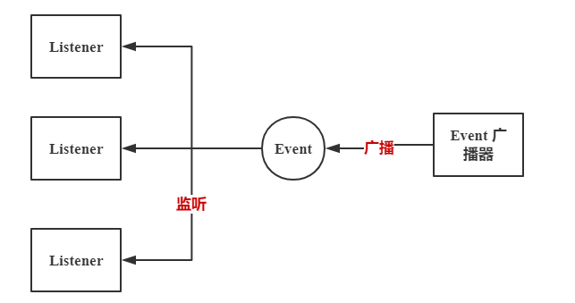

# 理解Spring技术栈或许没有那么难

## Spring Framework核心特性

### IOC container( IOC 容器)

- Java Bean
  - Setter/Getter method （也不完全是。没有get 、set 也可以是 java bean）
- Java Beans(规范)
  - 内省
    - 基础核心特性：反射（Reflection）
    - 附加特性：引用（Reference）
      - `Reference`
        - `SoftReference`
        - `WeakReference`
        - `phantomReference`
        - `finalreference`
    - `BeanInfo`
      - `BeanDescriptor`
      - `PropertyDescriptor`
        - 事件 ：`PropertyChangeEvent`
          - `java.util.EventOjbect`
        - 监听器：`PropertyChangeListener`
          - `java.util.EventListener`
      - `MethodDescriptor`
- IOC(反转控制)
  - 应用不关心依赖组件的来源，通过一定的 DI 方式查找
  - 抄袭了Java EE 概念，Java EE 容器（EJB 容器、JSF 容器）
    - EJB容器
      - Bean模式
        - **Local**
          - 容器 Bean
        - **Remote**
          - **RMI**
      - Bean类型
        - 会话（Session Bean）
          - 无状态 Bean
          - 有状态 Bean
        - 持久化（persistence Bean）
          - hibernate
        - 消息驱动 Bean（Java Messaging Bean）
          - JMS
            - AcitveMQ、Kafka
- DI（依赖注入）
  - Java EE :
    - JNDI (Java Naming and Directory Interface)
      - `Javax.naming.Context`
        - 名称
          - `javax.naming.Context#lookup(java.lang.String)` 
          - `javax.naming.Context#lookup(javax.naming.Name)`
    - EJB
      - `javax.ejb.@Ejb`
  - 依赖查找（Dependency Lookup）
    - ID、别名、名称查找
      - `BeanFacoroy#getBean(String)` : Object
    - 类型查找
      - `BeanFactory#getBean(Class)` : T
    - 注解查找
      - `ListableBeanFactory#getBeanWithAnnotation(Class)`
    - `FacotryBean`查找
      - `FactoryBean#getObject()`
    - `ObjectFacotry`查找
      - `ObjectFacotry#getObject()`
  - 依赖注入（组件依赖 Depenency，注入 injection）
    - 方法
      - Spring `@Autowired` 
      - Java `@Resource` 
      - Java EE `@Inject` 
    - 途径
      - 字段注入（Filed）注入
      - 属性（Setter）注入
      - 方法（Method）注入
      - 构造器（Constructor）注入


### Events

Essentially, this is the standard Observer design pattern.

简而言之。观察者模式的拓展

##### 核心模式： 观察者模式

#### **Spring 事件：AplicationEvent**

- `java.util.EventObject`

#### **Spring 事件监听器：ApplicationListener**

- `java.util.EventListener`

**Spring 事件广播器 : ApplicationEventMulticaster** 

- `SimpleApplicationEventMulticaster`

  ```java
  @Override    
  public void multicastEvent(
      final ApplicationEvent event, @Nullable ResolvableType eventType) {        					ResolvableType type = (eventType != null ? eventType : resolveDefaultEventType(event));     
        for (final ApplicationListener<?> listener : getApplicationListeners(event, type)) {            		Executor executor = getTaskExecutor();
             if (executor != null) { 	  
                 executor.execute(() -> invokeListener(listener, event));    
             }else {
                 invokeListener(listener, event);
             }      
       }  
   }
  ```

  

 Bean 生命周期管理之一

- 事件（包装）数据变化


### **Resources**

#### **Java 资源管理**

**URL 资源管理** 

- 协议
  - 获取协议： `java.net.URL#getProtocol`
  - 协议处理 
    - HTTP： `sun.net.www.protocol.http.Handler` 
    - FTP： `sun.net.www.protocol.http.Handler` 
    - HTTPS： `sun.net.www.protocol.http.Handler` 
    - File： `sun.net.www.protocol.http.Handler` 
    - Email：`sun.net.www.protocol.emailto.Handler` 

#### **ClassLoader（Class Path） 资源管理**

- 资源
  - 获取当前 ClassLoader 资源 URL： `java.lang.ClassLoader#getResource(String)` 
  - 获取当前 ClassLoader 所有资源 URL： `java.lang.ClassLoader#getResources(String)` 
  - 获取当前 ClassLaoder 资源 `InputStream` ： `java.lang.ClassLoader#getResourceAsStream(String)`

> 第一个找到就直接返回，
>
> 第二个，全部找一边

#### Spring 资源管理

资源定位： `classpath:/META-INF/abc.properties`

多资源定位： `classpath*:/META-INF/abc.properties`

### `Resource` 接口

`URL` 、 File和 `ClassLoader`封装实现

语义：

- 资源定位（ `URL`、 `File `） 

- 资源流读取（ `InputStream `）

  

- 实现类

  - `ClassPathResource` 
  - `getURL()` -> `ClassLoader#getResource(String)` 
  - `getInputStream()` -> `ClassLoader#getResourceAsStream(String)` 

- 加载器

  - `ResourceLoader` 
    - 获取 `Resource` : `ResourceLoader#getResource(String)` 
    - 默认实现： `DefaultResourceLoader` 
      - 前缀 =  "classpath:" ->  `ClassPathResource`
      - 否则 -> `FileUrlResource` 或 `UrlResource`

- 协议扩展

  - `ProtocolResolver` 
    - 通过路径解析出 `Resource` 

> 资源管理是可以拓展的。

### i18n

#### Java i18n

  Java 标准接口 `ResourceBundle`

- < Java 1.6 : 乱码，解决方案 native2ascci 
- Java 1.6 `ResourceBundle.Control` 
- Java 1.8 `ResourceBundleControlProvider` 
  - Java 1.6 `ServiceLoader` SPI


#### Spring MessageSource

- `MesasgeFormat` 

  - Hello,{0} -> 0="World"  -> Hello,World 

- 实现类

  - `ResourceBundleMessageSource` 

    > 只认识 properties
    >
    > 默认的 编码 `ISO-8859-1` 
    >
    > 如果设置了编码，就按照你设置的编码来，所以 Spring 就能解决乱码问题。

### Validation

#### Java Bean Validation （JSR-308）

java 的 非常难用

### Spring Validator

  Spring Validator + Bean Validation : `LocalValidatorFactoryBean` 

### 使用场景

- 标准 Java Bean 校验 
- Spring MVC 校验
  - Form 校验、 `@RequestBody` 校验，可以自定义 
- Spring Boot 外部化配置
  - `@ConfigurationProperties`


### Data Binding

#### 使用场景

- Spring 自定义绑定 
- Spring MVC 参数绑定 
- Spring Boot 外部化配置 
  - `@ConfigurationProperties`

### Type Conversion

常见类型装换

自定义装换


`ConversionService`


#### 使用场景

- Spring Boot 外部化配置 
  - `@ConfigurationProperties`  


> `ConversionService` 

## SpEL


### AOP


# Spring Boot 实际的场景


>  `org.springframework.core.io.support.SpringFactoriesLoader`  扩展实现
>
> `ApplicationStartedEvent`  `@Since 2.0.0` 错了，应该是 `@revised ...` 重新定义。
>
> Spring Boot 2.x 不再拓展实现 `WebMvcConfigurerAdapter` ，只需要 `WebMvcConfigurer` ，因为它，基于 Spring Framwwork 5.x  ，基于 JDK 8 ， 接口有 default 接口，不再需要实现了。


## 不适合场景

多 DataSource 

多 事务


Reactive -> RxJava 或者 Reactor

Java 8 CompletableFuture、Java 9 Flow API 

Vert.x ->   


#### Spring Cloud 应该怎么学

     

    

##### IOC-DI

> ```java
> public class IOCDemo {
> 
>     @Autowired
>     private String name;
> 
>     @Autowired
>     public IOCDemo(Integer age) {
>         this.age = age;
>     }
> 
>     @Autowired
>     public void setName(String name) {
> 
>     }
> 
>     private Integer age;
> 
>     public static void main(String[] args) {
> 
>     }
> }
> ```
>
> 我不需要关心这些组件从哪里来。

##### 事件

> java 的事件机制是通过  `java.util.EventOjbect` 和`java.util.EventListener` 来进行组装的。
>
> 
>
> 
>
> 大容易钻牛角尖，反而学不好。


##### JAVA 拓展 协议 ，利用 Spring 扩展协议

```java
public class DefaultResourceLoaderDemo {
    public static void main(String[] args) throws IOException {
        DefaultResourceLoader resourceLoader = new DefaultResourceLoader();
        resourceLoader.addProtocolResolver((location, resourceLoader1) -> {
            if (location.startsWith("darian://"))
                return new ClassPathResource(location.substring("darian://".length()));
            return null;
        });

        Resource resource = resourceLoader.getResource("darian://application.properties");

        String resoureString = StreamUtils.copyToString(resource.getInputStream(),
                Charset.forName("UTF-8"));
        System.out.println(resoureString);

    }
}
```