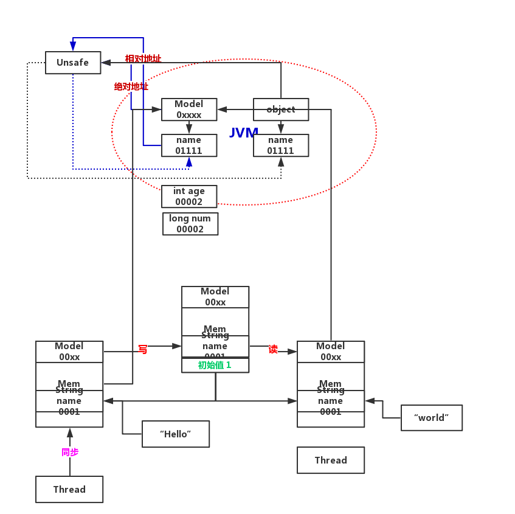

> **https://github.com/mercyblitz/confucius-commons**  分析这个工程里的东西。

###### 奇技淫巧出处：

1793 年，马格尔你，英国外交部长，乾隆 80 大寿，演示了 大炮，乾隆说 这是**奇技淫巧**。

#### 议题

- 四方书揭秘
- 代码工程示范
- 如何选择技术

 

## JAVA SE

分布式

IBM 云计算

微服务 != Spring Boot / Spring Cloud

区块链

大数据


> ​	这些名字都是不懂技术的人创造出来的名词，他们都不懂技术细节。还是基础比较好。

##### 基础很重要

- #### Java 1.4

  - NIO

- #### Java 1.5

  - For Each
  - 泛型
  - J.U.C
  - 可变参数
  - Iterable\<T>
    - Collection
    - Array[]
  - Formatter
  - 枚举
  - Annotation

- #### Java 1.6  (SCJP)

  - `java.util.ServiceLoader ` 

- #### Java 7

  - Try 升级
  - NIO
    - Path 抽象
    - AIO
  - AutoCloseable
  - Switch 提升
    - 字符串
  - 泛型升级
    - HashMap\<String> map = new HashMap<>();

- #### Java 8 

  - Lambda
  - Stream API
  - DateTime API
  - Interface default 实践
  - Optional
  - Java concurrency
    - CompletableFuture
    - StampLock
    - Accumulator


> #### Practical.API.Design.Confessions.of.a.Java.Framework.Architect.pdf
>
> 告诉你怎么设计 API 
>
> 告诉你版本的概念
>
> - 源代码兼容
>
>   - Java 语言级别的兼容
>
> - 二进制兼容
>
>   - Java 字节码的兼容（Java 4 Java 5）
>
>     > JDK 4 和 JDK 5 的一些字节码是不一样的。
>     >
>     > 类的不兼容。
>
>   


> Function 接口的
>
> - 例子：
>
>   ```java
>   package com.darian.java.lambda;
>   
>   
>   import java.util.function.Function;
>   
>   public class FunctionDemo {
>       public static void main(String[] args) {
>           DefaultServiceInvoker<UserService> serviceInvoker =
>                   new DefaultServiceInvoker<>(new UserService());
>   
>           serviceInvoker.invoke(userService -> {
>   
>           });
>   
>       }
>   
>       public static class UserService{
>   
>       }
>   
>       public interface ServiceInvoker<T> {
>   
>           <R> R invoke(Function<T,R> func);
>       }
>   
>       public static class DefaultServiceInvoker<T>
>               implements ServiceInvoker<T>{
>   
>           private final T service;
>   
>           public DefaultServiceInvoker(T service) {
>               this.service = service;
>           }
>   
>   
>           @Override
>           public <R> R invoke(Function<T, R> func) {
>               return func.apply(service);
>           }
>       }
>   }
>   ```


> ### [mercyblitz](https://github.com/mercyblitz)/**confucius-commons** : [链接](https://github.com/mercyblitz/confucius-commons)
>
> UnsafeUtils.java 种，稍有不慎 JVM 就挂掉了。
>
> - 在 Abstract 里边设置了常量。


Unsafe -> 内存偏移量来调整字段状态

- 写操作
  - 直接写
  - volatile 写
  - CAS


Model  对象的内存的绝对地址 0XXXX

- int value 内存的相对地址   00001
- int value =  0XXXX + 00001


主要是利用内存偏移量，直接操作内存



普通的 get ,set

偏移量都是一样的。它的内存地址是不一样的，但是内存的偏移量都是一样的。

顺序写。


所有的对象都存在 Object 对象

object 内存空间？

字段占用偏移量

- Object 拓扑结构，
- Unsafe 偏移量
- JVM 相关的特性

JAVA 9 里边的 `VarHandle.java` 中也有偏移量。有所谓的弱和强的方法。


Native Method

原生方法  底层方法。

Native = OS     只是一个操作系统的方法，C  、 C++


> mercyblitz :   `WindowsRegistry.java` 


`java.util.prefs.Preferences`  这个是在 Windows 上操作 `注册表` 。

```java
public class PreferencesTest {
    public static void main(String[] args) {
        // 很像 ZK Node
        Preferences preferences = Preferences.userRoot();
        preferences.put("Hello", "world");
        preferences.get("Hello", "");

        System.out.println(preferences.get("Hello", ""));
    }
}
```


windows 会提示你，当前用户还是机器。

```java
public class WindowsRegistryTest {

    @Test
    public void testInit() {
        if (SystemUtils.IS_OS_WINDOWS) {
            WindowsRegistry user = WindowsRegistry.currentUser();
            String key = "\\Software\\Microsoft\\Windows\\CurrentVersion\\Run";
            String name = "ABC";
            String value = "value.exe";
            user.set(key, name, value);
            user.flush(key);
            Assert.assertEquals(value, user.get(key, name));
            user.remove(key, name);
        }
    }
}
```

这就是一个类似的方式去进行操作。 调用 Windows 的 API。


我有 ？JAVA 运行 Node.js 程序怎么办？我写一个 `进程执行器` ProcessExecutor，

`java.lang.Process`  

```java
// 子进程
public Stream<ProcessHandle> children() {
    return toHandle().children();
}
```


IDEA 也是一个父线程控制子线程，然后控制进程

```java
public class ProcessExecutorTest {

    public void testExecute2() throws Exception {
        ProcessExecutor executor = new ProcessExecutor("java","-version");
        executor.execute(System.out, 2000);
    }
}
```

- idea
  - java
    - Java -version
    - Java -version
    - Java -version
    - Java -version


Runtime exec 是一样的。


流：

- 输入流      in
- 输出流      out
- 错误流       err


进程会有一个超时管理。还可以有嵌套的情况。


虚拟化技术可以限制计算机的 `CPU` 和 `内存` 的利用率。

> java 改注册表，进行进程管理都可以。


debug 的时候，可以阻断这个线程。


```java
public class StackTraceDemo {
    public static void main(String[] args) {
        Stream.of(Thread.currentThread().getStackTrace())
                .forEach(System.out::println);
    }
}
```

堆栈。


Spring Boot 里的 

SpringApplication 里边推断我的主类。

##### `org.springframework.boot.SpringApplication` 

```java
// 推断我的主类
private Class<?> deduceMainApplicationClass() {
   try {
      StackTraceElement[] stackTrace = new RuntimeException().getStackTrace();
      for (StackTraceElement stackTraceElement : stackTrace) {
         if ("main".equals(stackTraceElement.getMethodName())) {
            return Class.forName(stackTraceElement.getClassName());
         }
      }
   }
   catch (ClassNotFoundException ex) {
      // Swallow and continue
   }
   return null;
}
```


java 只告诉你类名，方法名。

`java.lang.Throwable#getStackTrace`    `@since 1.4` 


找个地方记一下。


## 如何选择技术

这个方法提出来，对性能影响很大。


##### 预热：

​	JVM 启动的时候，不要看它第一次运行的结构，要看它第二次运行的结果。


取到我当前这个类调用是谁？

我通过堆栈找我这个类。


JVM 

- 栈
- 帧 Frame
  - method 1 -> method 2


栈就是 

1 method 2 

2 method 1 


`jdk.internal.reflect.Reflection#getCallerClass` 

```java
@CallerSensitive
@HotSpotIntrinsicCandidate
public static native Class<?> getCallerClass();
```

获取当前的调用类。


A -> B -> C

current class = c

\+ 1 B

\+1 A


native 方法会快。

字节码。


有所谓的调用 链路，就是压栈，压帧。

一个是字节码，一个是堆栈来操作的。


Spring Boot 会把当前线程，当前类打出来。

当 打印很多的时候，性能提升一百倍以上。


>怎么学到的。
>
>Class 里边

`java.lang.ClassLoader` 

```java
@CallerSensitive
public final ClassLoader getParent() {
    if (parent == null)
        return null;
    SecurityManager sm = System.getSecurityManager();
    if (sm != null) {
        // Check access to the parent class loader
        // If the caller's class loader is same as this class loader,
        // permission check is performed.
        // 安全检查要检查我当前的调用的类。
        checkClassLoaderPermission(parent, Reflection.getCallerClass());
    }
    return parent;
}
```


java 6 7 8 都有了


java 9 有了 

`Stack Walking API`  

`java.lang.Stackwalker` 

- 得到文件名
- 得到行号
- 得到方法名
- 性能极大的提升

java 是一个很大的体系。

JDK 的 API 更有用。


JAVA 6 3000 多个 API

JAVA 7

JAVA 8 更多


##### `com.sun.deploy.model.Resource`

- String getURL();
- String getVersion();
- long getLastModified();
- 。。。。

##### `org.springframework.core.io.Resource` 

- URL getURL() throws IOException;
- URI getURI() throws IOException;
- File getFile() throws IOException;
- String getFilename();

就是抄袭么？哈哈哈哈


> 怼过 josh Long，抄袭，极大的抄袭


Exception 慢的话，

ClassLoader 怎么知道我加载的层次呢？

ClassPath 的代码


- `-classpath ` 
- `-cp` 


ClassPathUtils

- 一个是 Root 的 classPath
- 一个是我们自己的 classPath


堆栈的速率的提高：

https://github.com/mercyblitz/confucius-commons/blob/master/confucius-commons-lang/src/test/java/org/confucius/commons/lang/reflect/ReflectionUtilsTest.java