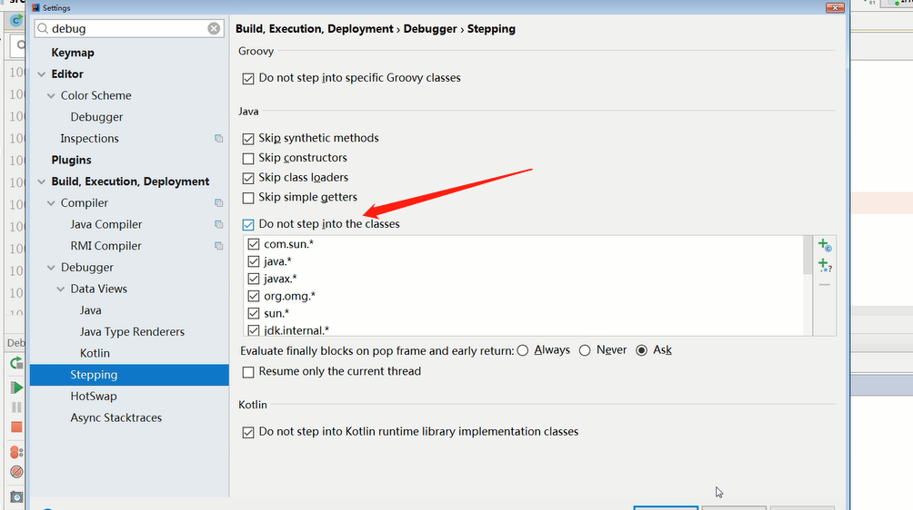

### 议题

- 为什么重谈 JAVA 面向对象设计
- “他山之石”


>  框架越来愈多，框架很少没有业务。很大的是一个开发效率。


### 为什么重谈 JAVA 面向对象的设计

- 设计的需要
- 成长的需要
- 理解的需要
- 创新的需要


> 设计的需要，你设计的是不是很完美
>
> Integer ， 封箱，拆箱


```java
public class IntegerDemo {
    public static void main(String[] args) {
        Integer value = 99;
        Integer value2 = new Integer(99);
        Integer value3 = Integer.valueOf(99);

        System.out.println("value equals value2:" + value.equals(value2));
        System.out.println("value equals value3:" + value.equals(value3));
    }
}
// -127 ~ 128
// equesls 比较的是值
```


```java
public class Integer{
    priate final int value;
}
```

##### 为什么是 final ?

答：final 修饰的字段，符合 **JAVA** 的内存模型。变量值避免泄露。

  《Effective Java》 书中写，成员尽量都用 **`final`**  。


启动参数加上 `java.lang.Integer.IntegerCache.high = 10` 

可以通过参数的调整来改动。

```java
String integerCacheHighPropValue =
    sun.misc.VM.getSavedProperty("java.lang.Integer.IntegerCache.high");
```

例如： Spring boot 的 **`外部化配置`** 。

`org.apache.commons.lang3.SystemUtils` 


`java.policy`  

`java.version` 不可以更改， 不同的版本，


### java 版本历史

- Java 1.4 : NIO 1.4

- java 5 : Formatter
- java 6 : JS on JVM
- Java 7 : Fork / Join NIO2
- Java 8 : Lambda

写代码要注意版本依赖。


读 `System.getProperty()` 的功能。

版本升级的时候不兼容情况。


`java.util.logging.Logger`  

`java.util.logging.LogManager` 


`java.util.logging.LogManager#readConfiguration()` 

有很多默认的配置文件，没有指定的时候，会用默认的路径来读取。

`java.home.lib.logging.properties`

.level = FINE 


有可能不确定因素，可能在你某段代码前调用了你设置的环境。

类加载尽量用 `-D java.utils.logging.config.file=` 确保你读取的时候，


Java 版本很多不同。

- windows 不同，linux 不同都不一样。


确认依赖版本，多查看 `@since __` 

`commons-langs 3.7`  `commons-langs 3.5`  

请注意二进制兼容 （ class / jar 兼容 ）

多考虑依赖有没有冲突。

在 Maven 构建系统中，减少二方库的传递依赖

你的依赖可能导致被人的程序无法正常运行。


##### 适配器-装饰器

- 适配器模式（前者转换后者，然后适配后者接口）  inputStream  -> Reader
- 装饰器模式(两者具备相同的父接口)  InputStream  -> ByteInputStream

##### 设计

- InputStreamReader 三个重载构造器
- 入参尽量保证接口或者抽象类（抽象类不够抽象，因为它有实现）
- 好的面向对象的设计通常存在方法重载，提供不同的来源渠道


### TreeMapDemo

- `java.lang.Comparable` 
  - String、Integer、Long、Byte
- `java.lang.Number` 
  - Integer、Long、Byte


接口比 抽象类更宽泛一点

并没有说，Key 必须要实现 `comparable` 接口。


你的接口允许是任意类型的时候，这个时候需要考虑到排序规则。所以就需要 `Comparable` 接口。


```java
// 重载
public TreeMap(Map<? extends K, ? extends V> m) {
    comparator = null;
    putAll(m);
}
```


JAVA 被常常批判为过度设计。

- 是不是符合我的需求。
- 说这句话的人的水平到底如何

我作为 **JDK** 我要面向我的所有人，我要满足所有人的需求， AuserCase, BuserCase，我要告诉你我的边界在什么地方。

这个人的水平到底如何。Java 类库又不是白痴，java 的类库，要考虑场景，Spring 官网介绍它的某一个特性，我们要反推为什么要有这个特性，不是证明我们对这个需求有多了解，而是要了解作者的想法，然后，我有类似的需求的时候，需要我怎么去做。


### Factory

`java.util.concurrent.ThreadFactory` 


工厂模式： 抽象工厂 + 静态工厂

并不是某种命名，一般建议通过 new Create 前缀

工厂模式：状态和无状态，可变和不可变

```java
Set<String> set = Set.of("Hello"); // 不可变的
ThreaFactory factory = (ruanble) -> new Thread(runable);

Thread thread = factory.newThread(() ->{
    System.out.println("Hello, world");
});
```


##### GoF23 远远不止。


`java.lang.Number`

- `java.lang.Integer` 
- `org.apache.commons.lang3.mutable.MutableInt` 

并不是说 `private final int value;`  变好，还是不变好。它给你了选择，

不变必然每次创建新的对象，是否存在必要性需要讨论。

```
LocalDateTime localDateTime = LocalDateTime.of(2018, 1 , 2, 23, 00);
```





#### 学习来源

- 知名开源工程（ JDK 、Commons 、Spring ）
- 良好业务代码

#### 借鉴设计

- 面向对象设计
- 面向切面设计
- 面向函数设计


> 需要 JAVA 9 


reactive 并不是由什么性能上的提升。函数的编程，闭包，有状态的代码块，Reactive - Stream 

被压 -> pressure