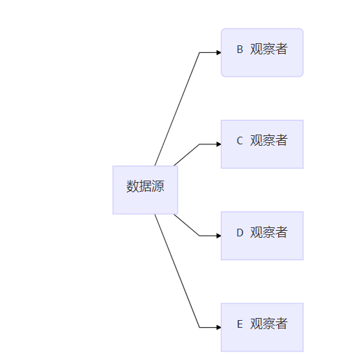
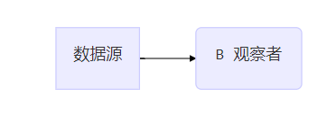
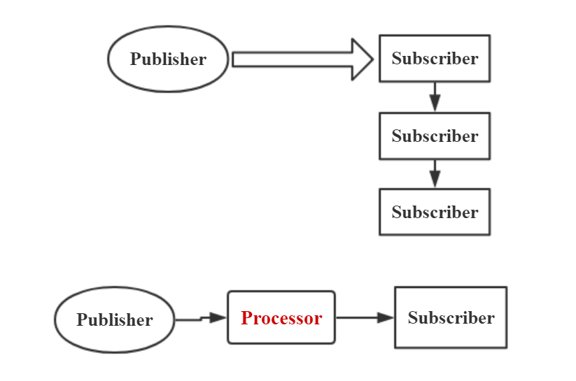

# Reactor Streams 并发编程之 Reactor

### 目标

- 理解 Reactive Streams 编程
- 了解 Reactor 基本使用
- 辅助理解 WebFlux （Spring Framwork 5）

### 议题

- Reactive Streams 规范
- Reactive Streams 框架 - Reactor
- QA

### Reactive Streams 前时代 

- 时代局限性（ Java 9 之前）
  - 阻塞编程
    - 无法并行计算
    - 资源低效使用
  - 异步编程
    - Callback
    - Future

### Reactive Streams 规范 

- Reactive 编程

  ​	一种异步编程的示范，这种示范与数据流式处理以及变化传播相关联，同时也经常被面向对象语言表示，作为一种观察者模式的扩展。

- Reactive Stream 规范（Java 语言）

  ​	 [https](https://github.com/reactive-streams/reactive-streams-jvm)[://](https://github.com/reactive-streams/reactive-streams-jvm)[github.com/reactive-streams/reactive-streams-jvm](https://github.com/reactive-streams/reactive-streams-jvm)    

#### 对比 Iterator 模式

- 数据方向
  - Reactive Streams ：推模式（Push）
  - Iterator ：拉模式（Pull）
- 编程模式
  - Reactive Streams：发布-订阅模式（Publish-Subscriber）
  - Iterator ：命令式编程模式（Imperative）

#### 信号

- onSubscribe()：订阅事件
- onNext()：数据达到事件
- onComplete()：订阅完成事件
- onError()：订阅异常
- request()：请求
- cancel()：取消

### Reactive Streams 框架 - Reactor 

- 核心接口
  - Mono：异步 0-1 元素序列
  - Flux：   异步 0-N 元素系列
- 编程方式
  - 接口编程
  - 函数式编程（Lambda）


- WebFlux
  - Reactor
    - Reactive Streams API

解决 JAVA 9 以前的异步编程

## Reactive 前时代

JAVA 9 之前，阻塞式，


- JAVA 1.4 NIO = Non-Blocking I/O
  - 连接事件
  - 读事件
  - 写事件


> # [Reactor pattern](https://en.wikipedia.org/wiki/Reactor_pattern)
>
> The reactor [design pattern](https://en.wikipedia.org/wiki/Design_pattern_(computer_science)) is an [event handling](https://en.wikipedia.org/wiki/Event_handling) pattern for handling service requests delivered [concurrently](https://en.wikipedia.org/wiki/Concurrency_(computer_science)) to a service handler by one or more inputs. The service handler then [demultiplexes](https://en.wikipedia.org/wiki/Demultiplex)the incoming requests and dispatches them synchronously to the associated request handlers.[[1\]](https://en.wikipedia.org/wiki/Reactor_pattern#cite_note-1) 

主要是多工，


> ### [3.1. Blocking Can Be Wasteful](https://projectreactor.io/docs/core/release/reference/#_blocking_can_be_wasteful)
>
> Modern applications can reach huge numbers of concurrent users, and, even though the capabilities of modern hardware have continued to improve, performance of modern software is still a key concern.
>
> There are broadly two ways one can improve a program’s performance:
>
> 1. **parallelize**: use more threads and more hardware resources.
> 2. **seek more efficiency** in how current resources are used.

阻塞是浪费的。用更多的线程和更多的资源用所谓的并行的方式。

更有效率的去尝试，有更多的资源去读一些东西。

讲的不完全对。


Tomcat、Netty 都是高并发，都是多线程的。

假如说你的 CPU 是 8 核的。

CPU processor  = 8

Tomcat/Netty Thread numbers = 16

- 1 Processor = 2 Threads
- 1 Processor = N Threads  一个处理器，多个线程，轮询执行/时间分片系统


如果你一次处理的时候，不会占用太多的 CPU

所以阻塞式的 I/O 要看情况，

如果是 CPU 密集型， Reactive 都无济于事

1 Thread 把 CPU 占满了，其它线程不得不等待。


> 一个 20G 的文件，给你一个 4G 内存的机器。如何快速的去读？
>
> 很多人说，高并发，开 20 个线程去读。
>
> 4G 内存的，用单线程 for 循环，可能都比它快。

要考虑场景，是 CPU 密集型，还是 I/O 密集型。

文件大的时候，Copy 的时候，是要看情况的。


>### 3.2. Asynchronicity to the Rescue?
>
>- **Callbacks**: Asynchronous methods do not have a return value but take an extra`callback` parameter (a lambda or anonymous class) that gets called when the result is available. A well known example is Swing’s `EventListener` hierarchy.
>- **Futures**: Asynchronous methods return a `Future<T>` **immediately**. The asynchronous process computes a `T` value, but the `Future` object wraps access to it. The value is not immediately available, and the object can be polled until the value is available. For instance, `ExecutorService` running `Callable<T>` tasks use `Future` objects.

`Future` 没有完成的周期回调，


Reactive Streams 规范。


Reactive 是一种观察者模式的扩展

Streams 流式

观察者模式、责任链模式、迭代器模式、发布-订阅模式


##### 观察者是一对多的过程。



##### 发布订阅者模式一对一



##### 迭代器模式：

```java
List<Integer> values = Arrays.asList(1, 2, 3, 4, 5);
```


​	Reactive Stream 这几种设计模式都能够找到它的影子，我们可以认为它像雨又像风，然后呢，可以看作这几种设计模式的整合，又加了点东西


## Reactive Streams

> # [Reactive Streams](https://github.com/reactive-streams/reactive-streams-jvm) 
>
> ### API Components
>
> The API consists of the following components that are required to be provided by Reactive Stream implementations:
>
> 1. Publisher
> 2. Subscriber
> 3. Subscription
> 4. Processor

#### 四种角色：

1. Publisher ： 发布者
2. Subscriber ： 订阅者
3. Subscription ： 订阅的控制器
4. Processor ： 发布者| 订阅者

##### 角色图解:




### 对比迭代器模式

​	我们打开一个 页面 ，刷新一下，就是 **拉** 的模式，

拉和推主要就是谁在推动。

##### `IteratorDemo` 

```java
public class IteratorDemo {
    public static void main(String[] args) {
        // 数据源
        // 这里是 JAVA 9 的 API
        List<Integer> values = List.of(1, 2, 3, 4, 5, 6);

        // 迭代
        // 消费数据
        Iterator<Integer> iterator = values.iterator();
        while (iterator.hasNext()){// 这个过程就是想服务器请求是否还有数据
            Integer value = iterator.next(); // 主动，获取数据
            System.out.println(value);
        }
    }
}
```


### 信号和事件是一样的意思

- `onSubscribe()`：订阅事件
- `onNext()`：数据达到事件 
- `onComplete()`：订阅完成事件 
- `onError()`：订阅异常 
- `request()`：请求 
- `cancel()`：取消

### Reactive Streams API、规范实现

- JAVA 9 Flow API
- RxJava : Reactive Extension Java
- Reactor : Reactor Framework

> 可能 API 你会，但是场景你可能不是很了解。


### Reactor 核心 API

- Mono : 异步的 0-1 元素序列，`Future<Optional<?>>`
- Flux:   异步  0-N 元素序列，    `Futrure<collection<?>>`


`CallBack` 代表 `org.springframework.util.concurrent.ListenableFuture` 

Reactive 之前就有了 

`org.springframework.util.concurrent.ListenableFuture`  

- `org.springframework.util.concurrent.ListenableFutureCallback`  
  - `org.springframework.util.concurrent.SuccessCallback`  
  - `org.springframework.util.concurrent.FailureCallback`  


```java
public interface ListenableFutureCallback<T> extends SuccessCallback<T>, FailureCallback {
}
```


`org.springframework.core.task.AsyncListenableTaskExecutor` 

- `org.springframework.core.task.SimpleAsyncTaskExecutor` 

`ListenableFuture` 它并不能够替代 Reactive


```java
/***
 * {@link org.springframework.util.concurrent.ListenableFuture}
 */
public class ListableFutureDemo {
    public static void main(String[] args) throws ExecutionException, InterruptedException {
        AsyncListenableTaskExecutor executor = new SimpleAsyncTaskExecutor();
        // ListenableFuture 实例
        ListenableFuture<Integer> future = executor.submitListenable(new Callable<Integer>() {
            public Integer call() throws Exception {
                return 1;
            }
        });

        // 欠佳 callBack
        future.addCallback(new ListenableFutureCallback<>() {
            public void onFailure(Throwable throwable) {
                Utils.println(throwable);
            }

            public void onSuccess(Integer integer) {
                Utils.println(integer);
            }
        });

        // Future 直到计算结果（阻塞）
        future.get();

        future = executor.submitListenable(() -> 2);
        // callback 消费完了就没有了
        future.addCallback(new ListenableFutureCallback<>() {
            public void onFailure(Throwable throwable) {
                Utils.println(throwable);
            }

            public void onSuccess(Integer integer) {
                Utils.println(integer);
            }
        });
        future.get();
    }
}
```

- callback 消费完了就没有了
- 它虽然是两个线程去执行的，但是，是阻塞直到结束，才下一个任务。所以是  `Future` 和 `Future` 之间是没有办法进行管理的。

`#sleep()`  也没有办法保证


#### `Future` 不足

- 不知道什么时候结束。 `ListenableFutureCallBack` 帮助增加成功的回调。
- Future 之间没有管理方式。


### ReactiveDemo

##### FluxDemo

```java
/***
 * {@link reactor.core.publisher.Flux}
 */
public class FluxDemo {
    public static void main(String[] args) {
        Random random = new Random();
        // 订阅并且处理（控制台输出）
        Flux.just(1, 2, 3, 4, 5, 6, 7)
                .map(integer -> {
                    // 当 随机数 == 3 抛出异常
                    if (random.nextInt(8) == 3) {
                        throw new RuntimeException("integer ==3");
                    }
                    return integer + 1;
                })
                .subscribe(
                        PrintUtils::printlnFormart,     // 处理数据  onNext()
                        PrintUtils::printlnFormart,     // 处理异常  onError()
                        () -> PrintUtils.printlnFormart("Subscription is completed!!")
                );
    }
}
```

```verilog
[Thread:main] : 2
[Thread:main] : 3
[Thread:main] : 4
[Thread:main] : java.lang.RuntimeException: integer ==3
```

会随机的结束或者异常。


```java
BiFunction<S, SynchronousSink<T>, S>
```

左支和右支

（a, b） -> a + b


##### FluxAPIDemo

```java
public class FluxAPIDemo {
    public static void main(String[] args) {
        Flux.generate(() -> 0, (value, sink) -> {
            if (value == 3) {
                sink.complete(); // 主动完成
            } else {
                sink.next("value = " + value);
            }
            return value + 1;
        }).subscribe(PrintUtils::printlnFormart, PrintUtils::printlnFormart,() -> {
            PrintUtils.printlnFormart("Subscription is completed!!!");
        });
    }
}
```

```verilog
[Thread:main] : value = 0
[Thread:main] : value = 1
[Thread:main] : value = 2
[Thread:main] : Subscription is completed!!!
```


> ### [4.5. Threading and Schedulers](https://projectreactor.io/docs/core/release/reference/#schedulers)
>
> The [`Schedulers`](https://projectreactor.io/docs/core/release/api/reactor/core/scheduler/Schedulers.html) class has static methods that give access to the following execution contexts:
>
> - The current thread (`Schedulers.immediate()`).
> - A single, reusable thread (`Schedulers.single()`). Note that this method reuses the same thread for all callers, until the Scheduler is disposed. If you want a per-call dedicated thread, use `Schedulers.newSingle()` for each call.
> - An elastic thread pool (`Schedulers.elastic()`). It creates new worker pools as needed, and reuse idle ones. Worker pools that stay idle for too long (default is 60s) are disposed. This is a good choice for I/O blocking work for instance.`Schedulers.elastic()` is a handy way to give a blocking process its own thread, so that it does not tie up other resources. See [How do I wrap a synchronous, blocking call?](https://projectreactor.io/docs/core/release/reference/#faq.wrap-blocking).
> - a fixed pool of workers that is tuned for parallel work (`Schedulers.parallel()`). It creates as many workers as you have CPU cores.


##### FluxAsyncDemo

```java
/***
 * {@link Flux} 异步操作
 */
public class FluxAsyncDemo {
    public static void main(String[] args) throws InterruptedException {
        // 当前线程
        Flux.range(0,10)
                .publishOn(Schedulers.immediate())
                .subscribe(PrintUtils::printlnFormart);

        // 单线程异步执行
        Flux.range(0,10)
                .publishOn(Schedulers.single())
                .subscribe(PrintUtils::printlnFormart);


        // 弹性线程池异步执行
        Flux.range(0,10)
                .publishOn(Schedulers.elastic())
                .subscribe(PrintUtils::printlnFormart);

        // 并行线程池执行
        Flux.range(0, 10)
                .publishOn(Schedulers.parallel())
                .subscribe(PrintUtils::printlnFormart);

        // 强制让主线程执行完毕，强制父线程执行完毕，那么子线程也必须执行完成
        Thread.currentThread().join();
    }
}
```


- `Schedulers.parallel()`   线程数和你的核心数一样。

  - ```java
    public static Scheduler parallel() {
        return cache(CACHED_PARALLEL, "parallel", PARALLEL_SUPPLIER);
    }
    static final Supplier<Scheduler> PARALLEL_SUPPLIER = () -> {
        // 这里是和你的处理器的核数是相等的
        return newParallel("parallel", Runtime.getRuntime().availableProcessors(), true);
    };
    ```

- `Schedulers.elastic()` 

  - ```java
    public static Scheduler elastic() {
        return cache(CACHED_ELASTIC, "elastic", ELASTIC_SUPPLIER);
    }
     static final Supplier<Scheduler> ELASTIC_SUPPLIER = () -> {
            return newElastic("elastic", 60, true);
        };
    ```


FockJoin 也是和 `核心数` 相同的线程数。


## Spring 对 WebFlux 的说法---》》使用场景

> ### 1.1. Overview
>
> Why was Spring WebFlux created?
>
> Part of the answer is the need for a non-blocking web stack to handle concurrency with a small number of threads and scale with fewer hardware resources. Servlet 3.1 did provide an API for non-blocking I/O. However, using it leads away from the rest of the Servlet API, where contracts are synchronous (`Filter`, `Servlet`) or blocking (`getParameter`, `getPart`). This was the motivation for a new common API to serve as a foundation across any non-blocking runtime. That is important because of servers (such as Netty) that are well-established in the async, non-blocking space.
>
> The other part of the answer is functional programming. Much as the addition of annotations in Java 5 created opportunities (such as annotated REST controllers or unit tests), the addition of lambda expressions in Java 8 created opportunities for functional APIs in Java. This is a boon for non-blocking applications and continuation-style APIs (as popularized by `CompletableFuture` and [ReactiveX](http://reactivex.io/)) that allow declarative composition of asynchronous logic. At the programming-model level, Java 8 enabled Spring WebFlux to offer functional web endpoints alongside annotated controllers. 

非阻塞 Web 技术栈的需要，通过小的线程，并行的那个，小的，8 核的话，只有 8 个线程，只有少量的资源去进行伸缩。Servlet 3.1 提供了 非阻塞 I/O ，是因为函数式编程的原因。

- 反向压力

当你是阻塞的时候，非并行，同步处理的时候，是命令式的，

迭代器就是命令式编程模式


反向压力，一个是拉，一个是推。

服务端，想要发布多少发布多少，客户端并不知道，服务端有多少数据。

它是一个 **推** 的模式。！！


WebFlux 可以在 Tomcat ，也可以 在 Netty 上。


##### Reactor 官网说：

- 并行不行
- 非阻塞效率不行

异步编程，传统的 JAVA API 是没有函数式 API 的。

我能拿到一个 **值** ， 再 **计算** 就不行了


##### 函数式通用API

- `Consumer` 只进（返回）不出（参数）
- `Supplier` 只出（返回）不进 （参数）
- `Function` 又进（返回）又出（参数）
- `BiFunction` 二元操作 `#fuc(a, b)` 


#### JAVA 9 Flow API

```java
public class FlowDemo {
    public static void main(String[] args) throws InterruptedException {
        // 发布者
        try (SubmissionPublisher<String> publisher = new SubmissionPublisher<>();) {
            // 订阅
            publisher.subscribe(new StringSubscriber("A"));
            publisher.subscribe(new StringSubscriber("B"));
            publisher.subscribe(new StringSubscriber("C"));

            publisher.submit("Hello, world");
        }

        // 主线程等待
        Thread.currentThread().join();
    }

    private static class StringSubscriber implements Flow.Subscriber<String> {
        private final String name;

        private StringSubscriber(String name) {
            this.name = name;
        }

        @Override
        public void onSubscribe(Flow.Subscription subscription) {
            PrintUtils.printlnFormart("订阅者 [ " + name + " ] 开始订阅！");
            // 向服务器反向请求
            subscription.request(1);
        }

        @Override
        public void onNext(String item) {
            PrintUtils.printlnFormart("订阅者 [ " + name + " ] 接收数据:" + item);
        }

        @Override
        public void onError(Throwable throwable) {
            PrintUtils.printlnFormart("订阅者 [ " + name + " ] 订阅异常：" + throwable.getMessage());
        }

        @Override
        public void onComplete() {
            PrintUtils.printlnFormart("订阅者 [ " + name + " ] 完成订阅");
        }
    }
```


```java
// 向服务器反向请求
subscription.request(1);
```


```verilog
[Thread:ForkJoinPool.commonPool-worker-23] : 订阅者 [ C ] 开始订阅！
[Thread:ForkJoinPool.commonPool-worker-19] : 订阅者 [ B ] 开始订阅！
[Thread:ForkJoinPool.commonPool-worker-5] : 订阅者 [ A ] 开始订阅！
[Thread:ForkJoinPool.commonPool-worker-23] : 订阅者 [ C ] 接收数据:Hello, world
[Thread:ForkJoinPool.commonPool-worker-19] : 订阅者 [ B ] 接收数据:Hello, world
[Thread:ForkJoinPool.commonPool-worker-5] : 订阅者 [ A ] 接收数据:Hello, world
[Thread:ForkJoinPool.commonPool-worker-5] : 订阅者 [ A ] 完成订阅
[Thread:ForkJoinPool.commonPool-worker-23] : 订阅者 [ C ] 完成订阅
[Thread:ForkJoinPool.commonPool-worker-19] : 订阅者 [ B ] 完成订阅
```


如果 接收到数据直接完成

```java
//.........
private static class StringSubscriber implements Flow.Subscriber<String> {
    private final String name;
    private Flow.Subscription subscription;

    private StringSubscriber(String name) {
        this.name = name;
    }

    @Override
    public void onSubscribe(Flow.Subscription subscription) {
        PrintUtils.printlnFormart("订阅者 [ " + name + " ] 开始订阅！");
        // 向服务器反向请求
        subscription.request(1);
        this.subscription = subscription;
    }

    @Override
    public void onNext(String item) {
        PrintUtils.printlnFormart("订阅者 [ " + name + " ] 接收数据:" + item);
        subscription.cancel();
    }

    @Override
    public void onError(Throwable throwable) {
        PrintUtils.printlnFormart("订阅者 [ " + name + " ] 订阅异常：" + throwable.getMessage());
    }

    @Override
    public void onComplete() {
        PrintUtils.printlnFormart("订阅者 [ " + name + " ] 完成订阅");
    }
}
```


```verilog
[Thread:ForkJoinPool.commonPool-worker-5] : 订阅者 [ B ] 开始订阅！
[Thread:ForkJoinPool.commonPool-worker-19] : 订阅者 [ A ] 开始订阅！
[Thread:ForkJoinPool.commonPool-worker-9] : 订阅者 [ C ] 开始订阅！
[Thread:ForkJoinPool.commonPool-worker-9] : 订阅者 [ C ] 接收数据:Hello, world
[Thread:ForkJoinPool.commonPool-worker-5] : 订阅者 [ B ] 接收数据:Hello, world
[Thread:ForkJoinPool.commonPool-worker-19] : 订阅者 [ A ] 接收数据:Hello, world
```


有些词语不是特别的好理解。

JAVA 9 Flow API


```java
@Override
public void onNext(String item) {
    PrintUtils.printlnFormart("订阅者 [ " + name + " ] 接收数据:" + item);
    if (new Random().nextBoolean() == false)
        subscription.cancel();
    else
        throw new RuntimeException(".........runtime exce....");
}
```

我们可以摸拟错误。

```verilog
[Thread:ForkJoinPool.commonPool-worker-9] : 订阅者 [ C ] 开始订阅！
[Thread:ForkJoinPool.commonPool-worker-5] : 订阅者 [ A ] 开始订阅！
[Thread:ForkJoinPool.commonPool-worker-19] : 订阅者 [ B ] 开始订阅！
[Thread:ForkJoinPool.commonPool-worker-9] : 订阅者 [ C ] 接收数据:Hello, world
[Thread:ForkJoinPool.commonPool-worker-19] : 订阅者 [ B ] 接收数据:Hello, world
[Thread:ForkJoinPool.commonPool-worker-5] : 订阅者 [ A ] 接收数据:Hello, world
[Thread:ForkJoinPool.commonPool-worker-9] : 订阅者 [ C ] 完成订阅
[Thread:ForkJoinPool.commonPool-worker-19] : 订阅者 [ B ] 订阅异常：.........runtime exce....
[Thread:ForkJoinPool.commonPool-worker-5] : 订阅者 [ A ] 订阅异常：.........runtime exce....
```


- JAVA 8 `complateableFuture` 

- JAVA 9 `Flow` API

- WebFlux  可能需要人时间去理解。像雨像雾，又像风。


需要人去理解。


- Spring Boot 算是中间件。
- Spring Cloud 算是解决方案。


## QA

1. 算法这种东西，AI 里边 phython ，要很多神经元算法。

2. JAVA 9 模块化非常的大。

3. WebFlux 

   - 非阻塞IO
   - 函数式编程

   除了 JAVA 8、9 ，都很难进行异步编程。

   流式代码慢慢的流行。

4. `subscription.request(1)` 

   `#request` 是在数据的更新，重新的请求，推动数据的流转。


##### 大数据？

大数据没有很高深的东西，

大数据，是基础设施。

hodhop 、Hive 和 SQL 的语法都有些类似。所以大数据的数据挖掘才是有用的。

把数据进行处理才有用！！！


JDK 9 API

NIO

- eppole
- selector

