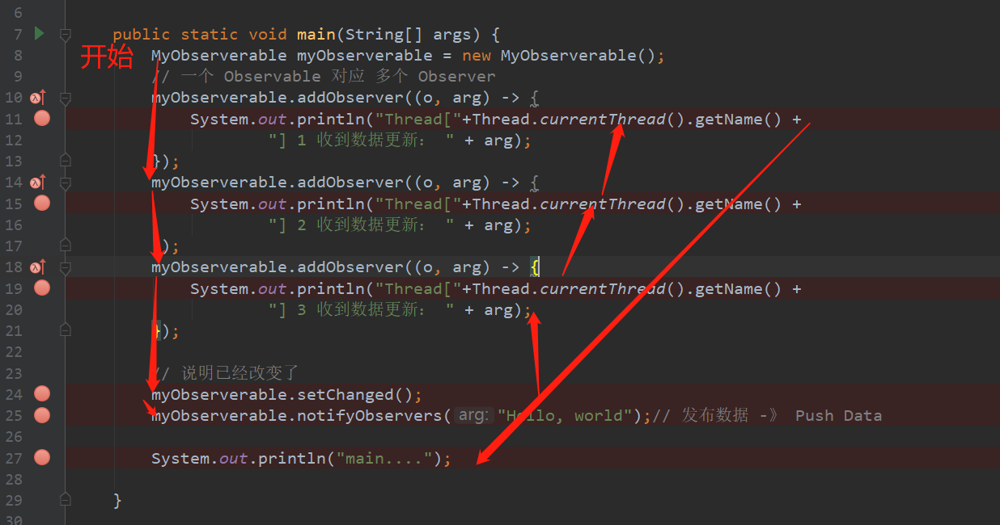
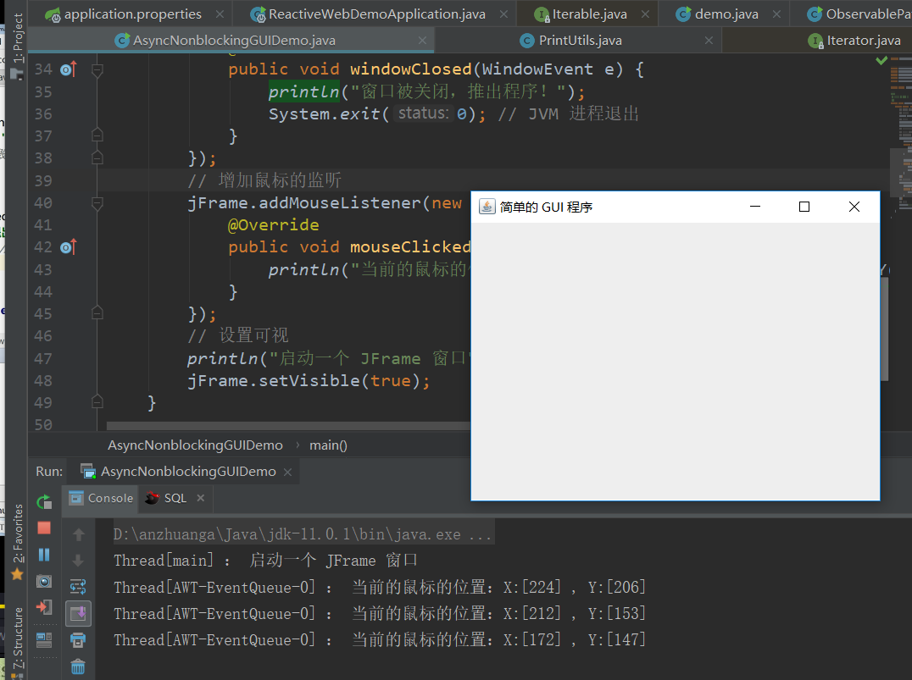
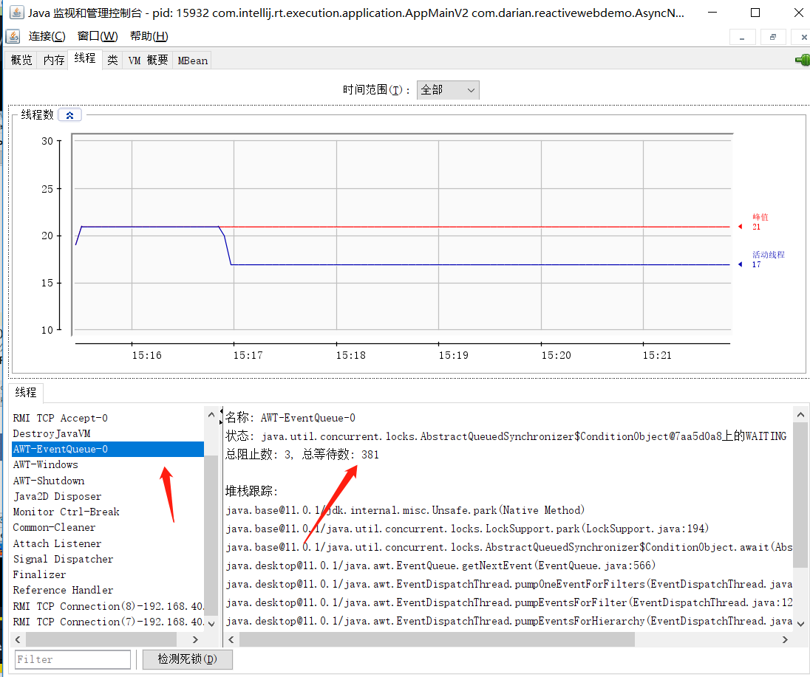
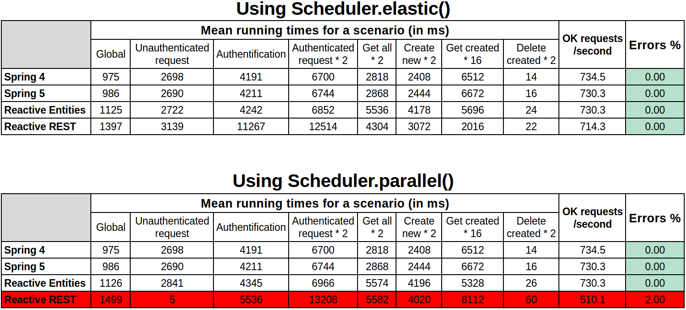

# JAVA Reactive Web 设计与实现

- Spring WebFlux 		Reactive Web
	 Spring Web MVC 		传统的 Servlet Web


- 编程模型：Non-Blocking  非阻塞

  - NIO ： 同步？ 异步？

    严格意义上讲 NIO 应该是同步的。

- 并发模型：

  - Sync 同步
  - Async 异步


## Reactive 概念

- Reactive Programming ： 响应式编程
- 命令式编程

### 特性

- 异步
- 非阻塞
- 事件驱动
- ~~多路复用~~   NIO 
- 有可能有背压   （backpressure）
- ~~解耦~~       设计层面的东西
- ~~高吞吐~~   目的
- ~~防止回调地狱~~     目的


#### 维基百科

> # [Reactive programming](https://en.wikipedia.org/wiki/Reactive_programming) 
>
> In [computing](https://en.wikipedia.org/wiki/Computing), **reactive programming** is a declarative [programming paradigm](https://en.wikipedia.org/wiki/Programming_paradigm) concerned with [data streams](https://en.wikipedia.org/wiki/Dataflow_programming) and the propagation of change. With this paradigm it is possible to express static (e.g., arrays) or dynamic (e.g., event emitters) *data streams* with ease, and also communicate that an inferred dependency within the associated *execution model* exists, which facilitates the automatic propagation of the changed data flow.[*citation needed*] 

是一个声明式的编程范式，关注于数据流，传播它们的改变。有可能表示为：

一个静态数组或者动态的事件发送器。(联想到 事件， `EventListener`  )


#### Reacitve-streams

> ## [Reactive-streams](https://github.com/reactive-streams/reactive-streams-jvm)
>
> ## Goals, Design and Scope
>
> Handling streams of data—especially “live” data whose volume is not predetermined—requires special care in an asynchronous system. The most prominent issue is that resource consumption needs to be carefully controlled such that a fast data source does not overwhelm the stream destination. Asynchrony is needed in order to enable the parallel use of computing resources, on collaborating network hosts or multiple CPU cores within a single machine.

处理数据流，尤其是一个动态的数据，（动态数据是一个运行的计算），它的容量是没办法评估的，是没办法预判的，因为它是活跃的，需要特殊的照顾，在异步系统里边。资源的消费需要小心仔细的控制， 快速的产生数据源的上流可能压垮了产生数据的下游。

- 异步系统
- 资源控制
- 关注消费。

## 实现框架

- RxJava
- Reactor


#### ReactiveX - RxJava

># [ReactiveX](http://reactivex.io/intro.html)
>
>ReactiveX is a library for composing asynchronous and event-based programs by using observable sequences.
>
>It extends [the observer pattern](http://en.wikipedia.org/wiki/Observer_pattern) to support sequences of data and/or events and adds operators that allow you to compose sequences together declaratively while abstracting away concerns about things like low-level threading, synchronization, thread-safety, concurrent data structures, and non-blocking I/O.

RxJava 是一个类库，把异步和事件驱动的程序进行组合。这里的程序是同一个进程里边的。它是不用的类，不同的组件里边。用在可观察的序列中。

可观察的序列？

它扩展了 观察者模式，（观察者模式 类似于 MVC，但是 MVC 是一个架构的模式。Observer 是一个设计层面上的。），支持一个数据（或者事件）的串。Sequences 是一个 List ，就是序列。有顺序。

- 从设计模式上来说是观察者模式的扩展，
- 从数据结构上来说是 Sequences 的扩展。

增加一些操作符，允许你组合处理的串，声明式的组合到一块。

它的抽象远离你关注的一部分

-  底层的线程
- 同步？
- 线程安全
- 并发数据结构
- NIO

这个框架组合我的 suquences ，再来屏蔽我的高并发的一些东西。

**高并发的成本还是很高的。** 

Reactive Programming 和 Reactive Function 两回事

>Rxjava
>
># Reactive Programming
>
>ReactiveX provides [a collection of operators](http://reactivex.io/documentation/operators.html) with which you can filter, select, transform, combine, and compose Observables. This allows for efficient execution and composition.
>
>You can think of the Observable class as a “push” equivalent to [Iterable](http://docs.oracle.com/javase/7/docs/api/java/lang/Iterable.html), which is a “pull.” With an Iterable, the consumer pulls values from the producer and the thread blocks until those values arrive. By contrast, with an Observable the producer pushes values to the consumer whenever values are available. This approach is more flexible, because values can arrive synchronously or asynchronously.

RxJava 提供了大量的操作符（组合我操作，远离并发操作）。

Observable 的核心实现就是一个 push （推） 的 迭代器。（这个并不是迭代器，只是一个可迭代的东西。）


> - 
>
>   ```java
>   // 这个 只是 forEach 语句的提升
>   public interface Iterable<T> {
>       Iterator<T> iterator();
>   }
>   ```
>
>   `java.util.Iterator`  迭代器
>
>   ```java
>   public class demo {
>       public static void main(String[] args) {
>           String[] values = {"hello, world"};
>           // 这里是拉的模式
>           for (String value : values) {
>               
>           }
>       }
>   }
>   ```
>
>   数组是一个 对象  `String[]` 他是实现了 接口 `Iterable<T>` 
>
>   所以它可以去迭代。
>
>   
>
>   - `Observalle` 事件发布源
>   - `observer` 观察对象


##### 观察者模式 Demo

```java
public class ObservablePattern {

    public static void main(String[] args) {
        MyObserverable myObserverable = new MyObserverable();
        // 一个 Observable 对应 多个 Observer
        myObserverable.addObserver((o, arg) -> {
            System.out.println("Thread["+Thread.currentThread().getName() +
                    "] 1 收到数据更新： " + arg);
        });
        myObserverable.addObserver((o, arg) -> {
            System.out.println("Thread["+Thread.currentThread().getName() +
                    "] 2 收到数据更新： " + arg);
        });
        myObserverable.addObserver((o, arg) -> {
            System.out.println("Thread["+Thread.currentThread().getName() +
                    "] 3 收到数据更新： " + arg);
        });

        // 说明已经改变了
        myObserverable.setChanged();
        myObserverable.notifyObservers("Hello, world");// 发布数据 -》 Push Data

    }

    private static class MyObserverable extends Observable {
        @Override
        public synchronized void setChanged() {
            super.setChanged();
        }
    }
}
```

```verilog
Thread[main] 3 收到数据更新： Hello, world
Thread[main] 2 收到数据更新： Hello, world
Thread[main] 1 收到数据更新： Hello, world
```

**是倒序的** 

JAVA 8 之前 你可以认为它是一个匿名内部类


###### 一个新的概念对于基础好的就是包装，对于基础差的就是天书了


##### 理解一下同步 + 非阻塞。

他不是按照上下文的顺序执行，




###### 非阻塞基本上采用 CallBack 形式，就是当时不阻塞。后边回调。


```java
public class ObservablePattern {

    public static void main(String[] args) {
        MyObserverable myObserverable = new MyObserverable();

        // 当前的实现是 同步 + 非阻塞
        println("observalber 添加观察者！！");
        // 一个 Observable 对应 多个 Observer
        myObserverable.addObserver((o, arg) -> println("观察者【1】 收到数据更新："+arg));
        myObserverable.addObserver((o, arg) -> println("观察者【2】 收到数据更新："+arg));
        myObserverable.addObserver((o, arg) -> println("观察者【3】 收到数据更新："+arg));

        println("observable 通知所有观察者！");
        // 说明已经改变了
        myObserverable.setChanged();
        myObserverable.notifyObservers("Hello, world");// 发布数据 -》 Push Data

        println("通知结束");

    }

    private static class MyObserverable extends Observable {
        @Override
        public synchronized void setChanged() {
            super.setChanged();
        }
    }
}
```


```verilog
Thread[main] ： observalber 添加观察者！！
Thread[main] ： observable 通知所有观察者！
Thread[main] ： 观察者【3】 收到数据更新：Hello, world
Thread[main] ： 观察者【2】 收到数据更新：Hello, world
Thread[main] ： 观察者【1】 收到数据更新：Hello, world
Thread[main] ： 通知结束
```

##### 当前的实现： 同步 + 非阻塞


##### 异步 + 非阻塞 GUI 工程实例

```java
/***
 * 异步非阻塞 + GUI 实例
 */
public class AsyncNonblockingGUIDemo {
    public static void main(String[] args) {
        // Swing JAVA GUI 类库
        // 创建一个窗口
        JFrame jFrame = new JFrame();
        // 简单的标题
        jFrame.setTitle("简单的 GUI 程序");
        jFrame.setBounds(300, 300, 400, 300);
        // 增加一个窗口关闭事件
        // 线程被切换 main -> AWT-EventQueue *
        // Reactive 这个就是
        jFrame.addWindowListener(new WindowAdapter() {
            @Override
            public void windowClosing(WindowEvent e) {
                println("销毁当前窗口");
                jFrame.dispose();
            }

            @Override
            public void windowClosed(WindowEvent e) {
                println("窗口被关闭，推出程序！");
                System.exit(0); // JVM 进程退出
            }
        });
        // 增加鼠标的监听
        jFrame.addMouseListener(new MouseAdapter() {
            @Override
            public void mouseClicked(MouseEvent e) {
                println("当前的鼠标的位置：X:[" + e.getX() + "] , Y:[" + e.getY() + "]");
            }
        });
        // 设置可视
        println("启动一个 JFrame 窗口");
        jFrame.setVisible(true);
    }
}
```


```verilog
Thread[main] ： 启动一个 JFrame 窗口
Thread[AWT-EventQueue-0] ： 当前的鼠标的位置：X:[224] , Y:[206]
Thread[AWT-EventQueue-0] ： 当前的鼠标的位置：X:[212] , Y:[153]
Thread[AWT-EventQueue-0] ： 当前的鼠标的位置：X:[172] , Y:[147]
Thread[AWT-EventQueue-0] ： 当前的鼠标的位置：X:[207] , Y:[130]
Thread[AWT-EventQueue-0] ： 销毁当前窗口
Thread[AWT-EventQueue-0] ： 窗口被关闭，推出程序！
```








就是轮询的时候，不停的在那里等待，等待的时候，总等待数，会不断地增加。

Reactive 就是无限的在轮询，不断地去处理。一个线程永远在不停的转，直到它挂掉未知。


#### Reactor

>### [3.2. Asynchronicity to the Rescue?](https://projectreactor.io/docs/core/release/reference/#_asynchronicity_to_the_rescue) 
>
>The second approach (mentioned earlier), seeking more efficiency, can be a solution to the resource wasting problem. By writing *asynchronous*, *non-blocking* code, you let the execution switch to another active task **using the same underlying resources** and later come back to the current process when the asynchronous processing has finished.
>
>But how can you produce asynchronous code on the JVM? Java offers two models of asynchronous programming:
>
>- **Callbacks**: Asynchronous methods do not have a return value but take an extra`callback` parameter (a lambda or anonymous class) that gets called when the result is available. A well known example is Swing’s `EventListener` hierarchy.
>- **Futures**: Asynchronous methods return a `Future<T>` **immediately**. The asynchronous process computes a `T` value, but the `Future` object wraps access to it. The value is not immediately available, and the object can be polled until the value is available. For instance, `ExecutorService` running `Callable<T>` tasks use `Future` objects.
>
>Are these techniques good enough? Not for every use case, and both approaches have limitations.
>
>Callbacks are hard to compose together, quickly leading to code that is difficult to read and maintain (known as "Callback Hell").
>
>Consider an example: showing the top five favorites from a user on the UI or suggestions if she doesn’t have a favorite. This goes through three services (one gives favorite IDs, the second fetches favorite details, and the third offers suggestions with details):


异步是救赎吗？他可以解决我们的问题吗？

- callback 

  异步方法不会返回一个值，但是它采取了额外的 callback 参数。它的回调会增多。

- Future


​	 `Callback` 会很难得组合在一起，会让你的代码难以阅读和维护的。（调入到 callback 的 噩梦中） 就是你添加一个回调，就需要添加一个回调方法。不便于理解。维护起来很麻烦。（还都是接口。JAVA 8 还好一点，可以增加 default 实现）

> 前端的回调噩梦更加严重

​	 `Future` 


> ### 难道 Reactor 就可以解决吗


`org.springframework.web.servlet.HandlerInterceptor` Spring 5 以后发生了改变。增加了默认的实现。

```java
public interface HandlerInterceptor {
    default boolean preHandle(HttpServletRequest request, HttpServletResponse response, Object handler) throws Exception {
        return true;
    }

    default void postHandle(HttpServletRequest request, HttpServletResponse response, Object handler, @Nullable ModelAndView modelAndView) throws Exception {
    }

    default void afterCompletion(HttpServletRequest request, HttpServletResponse response, Object handler, @Nullable Exception ex) throws Exception {
    }
}
```


以前是接口，

Spring 的传统。一个接口对应一个 `Adapter` ，如果我 实现接口，我就需要把每个方法都需要实现一下，就非常的麻烦。JAVA 8 就不需要实现了没有给方法了。


### `背压`的理解：

没有背压怎么办？照样办  ！！ 照样可以写代码。

> 用原始的 Servlet 实现 WebFlux ，然后甄别。


>### [1.1. Overview](https://docs.spring.io/spring/docs/5.1.3.RELEASE/spring-framework-reference/web-reactive.html#webflux-new-framework)
>
>Why was Spring WebFlux created?
>
>Part of the answer is the need for a non-blocking web stack to handle concurrency with a small number of threads and scale with fewer hardware resources. Servlet 3.1 did provide an API for non-blocking I/O. However, using it leads away from the rest of the Servlet API, where contracts are synchronous (`Filter`, `Servlet`) or blocking (`getParameter`, `getPart`). This was the motivation for a new common API to serve as a foundation across any non-blocking runtime. That is important because of servers (such as Netty) that are well-established in the async, non-blocking space.
>
>The other part of the answer is functional programming. Much as the addition of annotations in Java 5 created opportunities (such as annotated REST controllers or unit tests), the addition of lambda expressions in Java 8 created opportunities for functional APIs in Java. This is a boon for non-blocking applications and continuation-style APIs (as popularized by `CompletableFuture` and [ReactiveX](http://reactivex.io/)) that allow declarative composition of asynchronous logic. At the programming-model level, Java 8 enabled Spring WebFlux to offer functional web endpoints alongside annotated controllers.

​	为什么要 WebFlux？

​	第一个是非阻塞的 Web 技术栈处理并发（请注意，非阻塞技术栈不一定需要 WebFlux ，Servlet 也可以。） 用少量的线程，用少量的资源提高伸缩性。就是吞吐量。（那么请问，变快还是变慢，线程从多，到变少。当请求数量超过我处理请求的数量的时候，确实是会变慢的。）。Servlet 3.1 提供了非阻塞IO 的 API。但是使用 Servlet 其它的 API 会导致 `Servlet` 和 `Filter` 的同步，（这句话不会，Servlet 3.0 有一个异步的 Servlet。）和阻塞。

​	第二个是因为函数式编程的缘故。（这个不对，用不用函数式编程不重要，Rxjava，和 Reactive-streams 都没有告诉我们必须要用函数式编程，只是告诉我们用 lambda，lambda 和 函数式编程不能画等号。）


> #### 1.1.1. Define “Reactive”
>
> We touched on “non-blocking” and “functional” but what does reactive mean?
>
> The term, “reactive,” refers to programming models that are built around reacting to change — network components reacting to I/O events, UI controllers reacting to mouse events, and others. In that sense, non-blocking is reactive, because, instead of being blocked, we are now in the mode of reacting to notifications as operations complete or data becomes available.
>
> There is also another important mechanism that we on the Spring team associate with “reactive” and that is non-blocking back pressure. In synchronous, imperative code, blocking calls serve as a natural form of back pressure that forces the caller to wait. In non-blocking code, it becomes important to control the rate of events so that a fast producer does not overwhelm its destination.
>
> Reactive Streams is a [small spec](https://github.com/reactive-streams/reactive-streams-jvm/blob/master/README.md#specification) (also [adopted](https://docs.oracle.com/javase/9/docs/api/java/util/concurrent/Flow.html) in Java 9) that defines the interaction between asynchronous components with back pressure. For example a data repository (acting as [Publisher](http://www.reactive-streams.org/reactive-streams-1.0.1-javadoc/org/reactivestreams/Publisher.html)) can produce data that an HTTP server (acting as [Subscriber](http://www.reactive-streams.org/reactive-streams-1.0.1-javadoc/org/reactivestreams/Subscriber.html)) can then write to the response. The main purpose of Reactive Streams is to let the subscriber to control how quickly or how slowly the publisher produces data.

​	定义 "Reactive"

​	 `reactive` 是和编程模型相关，它是围绕着 **当变化的时候做出反应** 来构建，举个例子，网络组件的 I/O 事件，（NIO有 连接事件，读事件，写事件），UIcontroler , mouse events。（所以说，reactive 并不是一个很新鲜的事务。RxJava , reactor 只是一个框架，我不用 Rxjava， 不用 reator 我照样可以实现 reactive ），NIO 在某种程度上就是 reative ，因为它要取代被阻塞。对两种东西作出反应，当我完成的时候，数据到达的时候，作出反应。

​	 `Reactive Stream` 是小的规范。例如，数据仓库扮演着发布者的角色可以发布数据，HTTP Server 扮演一个消费者的角色，可以写入到我的响应里边去。


> ​	用 JAVA 的 Swing API 实现了 异步非阻塞。两个目标都实现了，Reactive 并不是一个新鲜事物，而且它并不是一定要用 RxJava 和 Reactor，维基百科没有锁定某一个框架和某种实现。
>
> 
>
> Reactive 和框架是有区别的。Reactive 只是告诉你一个原则，非阻塞，同步异步都可以，推拉模式的结合，所有的 Reactive 框架都会有写操作符的概念，


Spring 官方文档告诉我们可以在 Netty，Undertow，和 Servlet 3.1 + 的容器中。

所以我们利用 Servlet 3.1 可以实现 WebFlux 类似的功能。


## Reactive 理解误区

### Spring 官方文档

> #### 1.1.7. Performance vs scale
>
> Performance has many characteristics and meanings. Reactive and non-blocking generally do not make applications run faster. They can, in some cases, (for example, if using the `WebClient` to execute remote calls in parallel). On the whole, it requires more work to do things the non-blocking way and that can increase slightly the required processing time.
>
> The key expected benefit of reactive and non-blocking is the ability to scale with a small, fixed number of threads and less memory. That makes applications more resilient under load, because they scale in a more predictable way. In order to observe those benefits, however, you need to have some latency (including a mix of slow and unpredictable network I/O). That is where the reactive stack begins to show its strengths, and the differences can be dramatic.

性能和伸缩性

性能有很多方式和测量它的方式，Reactive 和 non-blocking 一般而言不是让程序变得更快，

同时，它们需要一个额外的工作去做一下事情 （NIO），反而会增加少量的程序运行时间。

我们程序都是顺序执行的。我们先抛开指令重排序的问题，每一行代码都是阻塞。

非阻塞是相对的，阻塞是绝对的。阻塞是绝对的，怎么合理的了利用内存才是关键。合理的利用线程才是问题的所在。

##### 所谓的性能优化，和性能调整是根据你应用的程序的特性因地制宜的来做调整的。而不是做一些有的没的东西。


> ​	如果，我用更少的线程，更少的资源，我的程序是不是变得更慢的。不一定，资源消耗够的时候，没什么区别，Tomcat 默认的最大的是 200 个线程，初始线程是 10 个线程，超过 200 个请求的时候，假设前边的程序都没有运行完，会发生阻塞，都丢到阻塞堆里边去。这就是线程池的概念，就是阻塞队列的概念。有一个缓存队列。
>
> 你是 200 个线程的时候。
>
> ```java
> public ThreadPoolExecutor(int corePoolSize,
>                           int maximumPoolSize,
>                           long keepAliveTime,
>                           TimeUnit unit,
>                           BlockingQueue<Runnable> workQueue,
>                           ThreadFactory threadFactory,
>                           RejectedExecutionHandler handler) {
> ```
>
> 当线程不够，进阻塞队列，阻塞队列没有了，就会进入到拒绝策略中去。200 个人任务，有 50个 线程的时候，150个请求在等待，如果是 http 请求，就容易超时，
>
> ### 使用场景，你只有了解它的本质，才能够理解它的使用场景。
>
> Web 程序和 Netty 是有区别的。

- Web ： 快速响应（Socket Connection Timeout 2s）

  

- 


200 q -> 200 T -> 50T

`1-50` `50-100` `100-150` `150-200` 

最后一批最慢了。分批次了。

Tomcat Connector Thread Pool(200) -> Reactive Thread pool (50) 

**我把 I/O 链接从 Tomcat 转移到了 Reactive 线程** 

- Tomcat 				 **链接**
	 Reactive Thread		 **任务处理** 

我Tomcat 就会变得活跃了，Tomcat 处理链接，Reactive 处理我的任务。

**我接客不影响你招待，你招待越快，我接客也会更快的。**


招待不过来，怎么办？

- Timeout
- 


理发店 只有 100 个人，来了 200 个人，会有 100 个人在等待， 

- 继续等（timeout 无限）
- timeout 20 走人（相当于设置一个过期时间）


> ​	要耐心地学习技术，急于求成是学不好技术的。


## Reactive 使用场景

所以 Reactive 并不是完全适用于 Web 应用


- Long Live 模式： Netty I/O 链接（RPC） Timeout
- short Live 模式


Netty 的线程在不断地循环，因为它像一个流水线一样的一个一个去处理，

但是 **short Live**  就不一样了，他需要你马上给我处理。

> 你去买冰棒，老板让你等一会，你就会崩溃。


HTTP 

HTTP 设置超时时间（5 min ）

短链接不适合做 Reactive ，因为你等的越多，积压的就越多。

如果 100 个人在等待，再来 100 个人 ，那就 200 个人在等待了。

对呀了越来愈多就会有问题了！！！


#### 另外一种实现方式就是消息队列。

Reactive Web 并不适用于 **短平快** 的i请求。


### WebFlux 是否提升性能

> https://blog.ippon.tech/spring-5-webflux-performance-tests/
>
>  


#### Spring 官方文档 1.17

> The key expected benefit of reactive and non-blocking is the ability to scale with a small, fixed number of threads and less memory. That makes applications more resilient under load, because they scale in a more predictable way. In order to observe those benefits, however, you need to have some latency (including a mix of slow and unpredictable network I/O). That is where the reactive stack begins to show its strengths, and the differences can be dramatic. 

​	 Reactive 和 Non-blocking 可以用少量的线程和少量的资源提升程序的伸缩性，并没有提到把它变快。它限定了我的资源消耗，保证我的程序的应用状态的稳定。


> 你来一个 1000 个请求，我处理 1000 个请求，会导致线程没有限制，线程池也是做这个事情。只不过我们把线程池的这个概念切换了一下。


#### 伸缩性：

单位时间内接收请求的数量。


## 设计 Reactive Web


> Servlet 3.1 文档
>
> #### 2.3.3.3 Asynchronous processing
>
> .......
> .....   container using the AsyncContext.dispatch method. A typical sequence of events
> for asynchronous processing is:


可以利用 AsyncContext 来实现异步的非阻塞式的编程。


#### Demo 代码：

```java
@WebServlet(urlPatterns = "/async",
        asyncSupported = true)
public class AsyncNonBlockingServlet extends HttpServlet {

    @Override
    public void doGet(HttpServletRequest request, HttpServletResponse response)
            throws ServletException, IOException {
        // 开启 异步的上下文
        AsyncContext asyncContext = request.startAsync();
        println("异步上下文触发开始");
        asyncContext.addListener(new AsyncListener() {
            @Override
            public void onComplete(AsyncEvent asyncEvent) throws IOException {
                ServletResponse response = asyncEvent.getSuppliedResponse();
                response.getWriter().println("hello, world");
                println("异步上下文执行完毕");
            }

            @Override
            public void onTimeout(AsyncEvent asyncEvent) throws IOException {
                println("异步上下文执行超时");
            }

            @Override
            public void onError(AsyncEvent asyncEvent) throws IOException {
                println("异步上下文执行错误");
            }

            @Override
            public void onStartAsync(AsyncEvent asyncEvent) throws IOException {
                println("异步上下文执行开始");
            }
        });
        println("异步上下文触发结束");
        // 完成操作
        asyncContext.complete();
    }
}
```


```verilog
Thread[http-nio-8080-exec-9] ： 异步上下文触发开始
Thread[http-nio-8080-exec-9] ： 异步上下文触发结束
Thread[http-nio-8080-exec-9] ： 异步上下文执行完毕
```

##### 同步非阻塞

http://localhost:8080/async


##### 异步非阻塞：

```java
/***
 * 异步 + 非阻塞的 Servlet
 */
@WebServlet(urlPatterns = "/async",
        asyncSupported = true)
public class AsyncNonBlockingServlet extends HttpServlet {

    @Override
    public void doGet(HttpServletRequest request, HttpServletResponse response)
            throws ServletException, IOException {
        // 开启 异步的上下文
        AsyncContext asyncContext = request.startAsync();
        println("异步上下文触发开始");
        asyncContext.addListener(new AsyncListener() {
            @Override
            public void onComplete(AsyncEvent asyncEvent) throws IOException {
                ServletResponse response = asyncEvent.getSuppliedResponse();
                response.getWriter().println("hello, world");
                println("异步上下文执行完毕");
            }

            @Override
            public void onTimeout(AsyncEvent asyncEvent) throws IOException {
                println("异步上下文执行超时");
            }

            @Override
            public void onError(AsyncEvent asyncEvent) throws IOException {
                println("异步上下文执行错误");
            }

            @Override
            public void onStartAsync(AsyncEvent asyncEvent) throws IOException {
                println("异步上下文执行开始");
            }
        });

        // 完成操作
        asyncContext.start(() -> {
            println("异步上下文触发结束");
            asyncContext.complete();
        });
    }
}
```


```verilog
Thread[http-nio-8080-exec-1] ： 异步上下文触发开始
Thread[http-nio-8080-exec-2] ： 异步上下文触发结束
Thread[http-nio-8080-exec-3] ： 异步上下文执行完毕
```

这里变成了 100% 异步


#### Servlet 规范

> ### 3.7 Non Blocking IO
>
> Non-blocking request processing in the Web Container helps improve the ever
> increasing demand for improved Web Container scalability, increase the number of
> connections that can simultaneously be handled by the Web Container. Nonblocking
> IO in the Servlet container allows developers to read data as it becomes
> available or write data when possible to do so. Non-blocking IO only works with
> async request processing in Servlets and Filters (as defined in Section 2.3.3.3,
> “Asynchronous processing” on page 2-10), and upgrade processing (as defined in
> Section 2.3.3.5, “Upgrade Processing” on page 2-20). Otherwise, an
> IllegalStateException must be thrown when
> `ServletInputStream.setReadListener` or
> `ServletOutputStream.setWriteListener` is invoked.


读的时候，`ReadListener` ;

写的时候， `WriteListener` 


**Response Write / outpustream 不能同时调用。**


```java
/***
 * 异步 + 非阻塞的 Servlet
 */
@WebServlet(urlPatterns = "/async",
        asyncSupported = true)
public class AsyncNonBlockingServlet extends HttpServlet {

    @Override
    public void doGet(HttpServletRequest request, HttpServletResponse response)
            throws ServletException, IOException {
        // 开启 异步的上下文
        AsyncContext asyncContext = request.startAsync();
        println("异步上下文触发开始");
        // 非阻塞回调
        asyncContext.addListener(new AsyncListener() {
            @Override
            public void onComplete(AsyncEvent asyncEvent) throws IOException {
                ServletResponse response = asyncEvent.getSuppliedResponse();

                response.getOutputStream().println("hello, world [1] ");

                println("异步上下文执行完毕");
            }

            @Override
            public void onTimeout(AsyncEvent asyncEvent) throws IOException {
                println("异步上下文执行超时");
            }

            @Override
            public void onError(AsyncEvent asyncEvent) throws IOException {
                println("异步上下文执行错误");
            }

            @Override
            public void onStartAsync(AsyncEvent asyncEvent) throws IOException {
                println("异步上下文执行开始");
            }
        });


        ServletOutputStream outputStream = response.getOutputStream();
        outputStream.setWriteListener(new WriteListener() {
            // 非阻塞 I/O
            @Override
            public void onWritePossible() throws IOException {
                outputStream.println("hello, world [2] ");
                println("异步 + 非阻塞I/O  执行完毕");
            }

            @Override
            public void onError(Throwable throwable) {

            }
        });


        // 完成操作
        asyncContext.start(() -> {
            println("异步上下文触发结束");
            asyncContext.complete();
        });
    }
}
```


```verilog
Thread[http-nio-8080-exec-1] ： 异步上下文触发开始
Thread[http-nio-8080-exec-2] ： 异步上下文触发结束
Thread[http-nio-8080-exec-1] ： 异步 + 非阻塞I/O  执行完毕
Thread[http-nio-8080-exec-1] ： 异步上下文执行完毕
```


非阻塞 I/O 不能够在异步撒谎给你下文中执行。


刷新网页，在 tomcat 中的是 有一定的随机的概率的。

```verilog
1
1
1
//------------
1
2
1

```


写的顺序不是随机的。

触发顺序是异步的。

执行的时候确实同步的。

没写非阻塞 I/O 的时候，结束的时候是没有 切换线程的。


## 实现 Reactive Web


