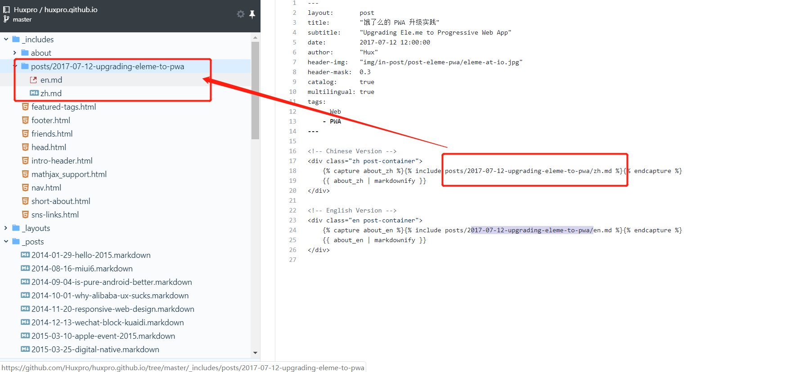
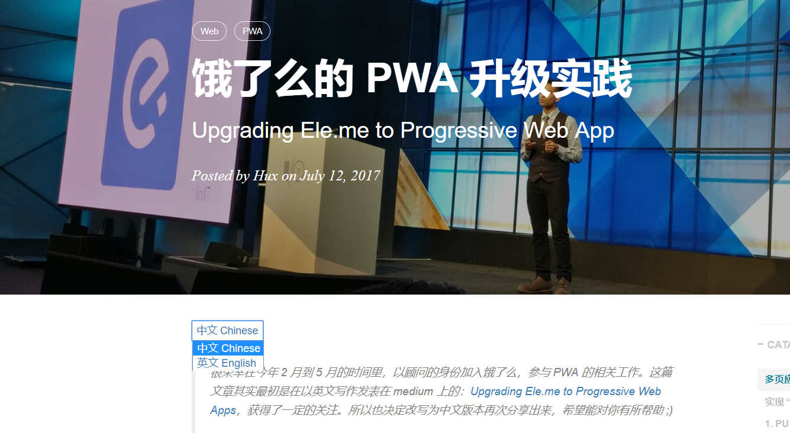
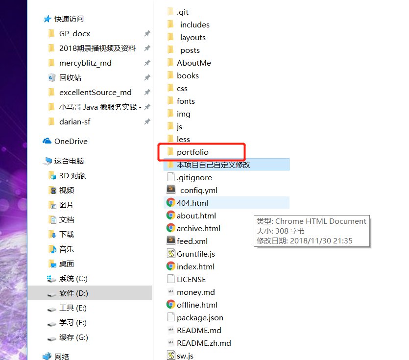

##### index.html

```html
---
layout: page
title: Darian Blog
author: Darian
description: "Talking is cheap, show me your code"
---
```


##### _includes/head.html

    <!-- Favicon -->
    <link rel="shortcut icon" href="{{ site.baseurl }}/img/favicon.ico">


##### _config.yml

```yaml
# Site settings
title: darian
SEOTitle: 技术博客
header-img: img/home-bg.jpg
email: 
description: ""
keyword: "darian"
url: ""              # your host, for absolute URL
baseurl: ""                             # for example, '/blog' if your blog hosted on 'host/blog'

post:
  author: darian

# Publish posts or collection documents with a future date.
future: true

# SNS settings
RSS: true
weibo_username:     darian
github_username:    darian
twitter_username:   darian

# Sidebar settings
sidebar: true                         Sidebar.
# 头像下边的文字
sidebar-about-description: "单纯的技术交流"
# 头像地址
sidebar-avatar: /img/darian.jpg

# Friends
# 友情链接，连接了 Mercyblitz 的博客
friends: [
     {
        title: "强烈推荐：mercyblitz Blog",
        href: "https://mercyblitz.github.io/"
    }
]
```


##### _includes/nav.html

```html
<!-- Collect the nav links, forms, and other content for toggling -->
<div id="huxblog_navbar">
    <div class="navbar-collapse">
        <ul class="nav navbar-nav navbar-right">
            <li>
                <a href="{{ site.baseurl }}/">首页</a>
            </li>
            <li>
                <a href="{{ site.baseurl }}/about/">关于我</a>
            </li>
            <li>
                <a href="{{ site.baseurl }}/archive/">归档文章</a>
            </li>
            <li>
                <a href="{{ site.baseurl }}/portfolio/">参与过的项目</a>
            </li>
        </ul>
    </div>
</div>
<!-- /.navbar-collapse -->
```


# 文章名字规则

2018-01-01-第一篇实例文章.md


如何构建一个- 中文-英文同时可以的文章

### 如何发布一篇文章-中文-英文都可以


Hux . 饿了吗实践


参见- https://github.com/Huxpro/huxpro.github.io/blob/master/_posts/2017-07-12-upgrading-eleme-to-pwa.markdown

```
---
layout:       post
title:        "饿了么的 PWA 升级实践"
subtitle:     "Upgrading Ele.me to Progressive Web App"
date:         2017-07-12 12:00:00
author:       "Hux"
header-img:   "img/in-post/post-eleme-pwa/eleme-at-io.jpg"
header-mask:  0.3
catalog:      true
multilingual: true
tags:
    - Web
    - PWA
---

<!-- Chinese Version -->
<div class="zh post-container">
    
    {{ about_zh | markdownify }}
</div>

<!-- English Version -->
<div class="en post-container">
    
    {{ about_en | markdownify }}
</div>

```




##### 效果图 




## 添加项目：




## portfolio/index.html

```html
<header>
    <!--  -->
    <!-- <h1>Hux</h1> -->
    
    <h1>Darian</h1>
</header>


<li>
    <div class="cbp_tmlabel">
        <h2 id="boxoffice">爱医生智慧医疗</h2>
        <time>2018.03</time>
        <!-- portfolio/images -->
        
        <ul>
            <li>
                北京爱医生智慧医疗科技有限公司是君正集团全资子公司，与世界科技巨头IBM公司深度战略合作，应用世界领先的认知医疗和人工智能技术，致力于打造国内创新智慧医疗平台爱医生携手医疗健康行业生态合作伙伴，基于人工智能技术和医疗健康数据，共同推动中国医疗健康领域创新，致力于成为中国家庭全面健康管理的顾问，基层医疗机构全科医生的助手，助力分级诊疗政策落地和健康中国战略实施
            </li>
            <li class="skill">
                <span><b>JS</b></span>
                <span class="i-react"></span>
                <span class="link"><a target="_blank" href="http://aiyisheng.com.cn/index.html">See it</a></span>
            </li>
        </ul>
    </div>
</li>
```


